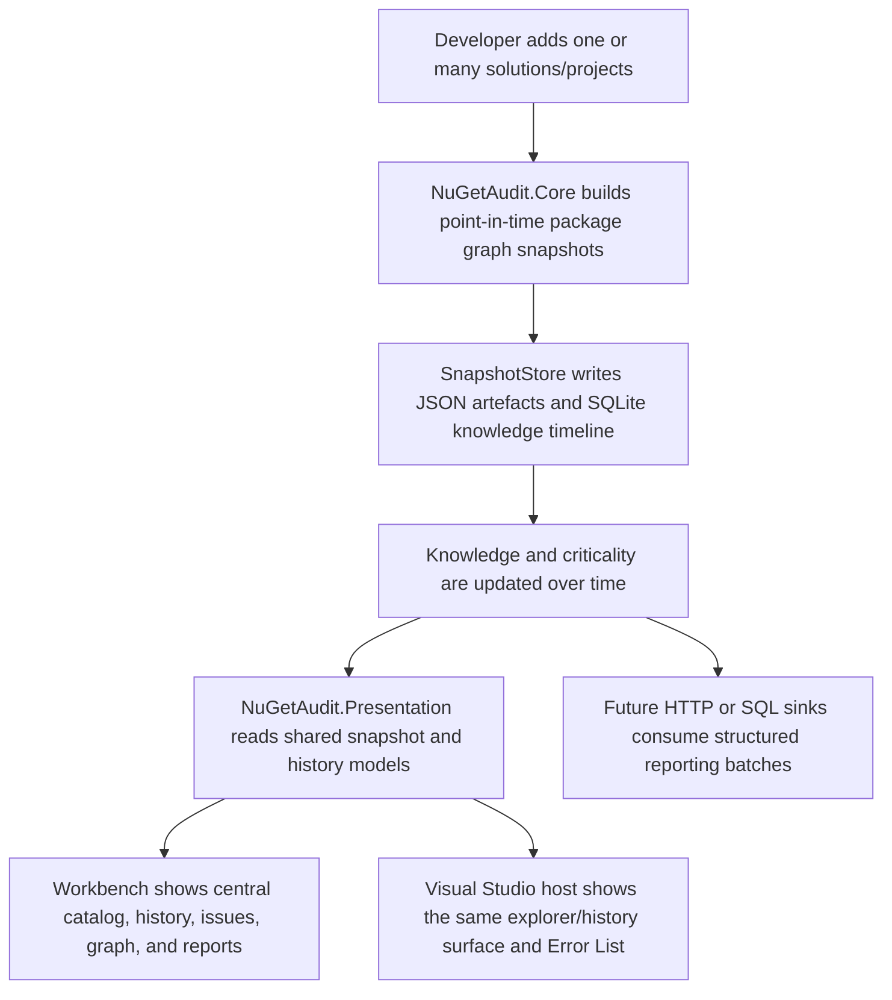
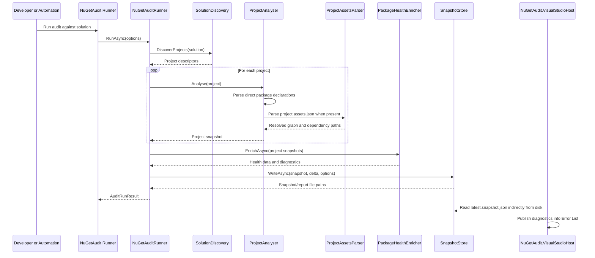
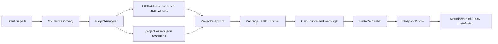
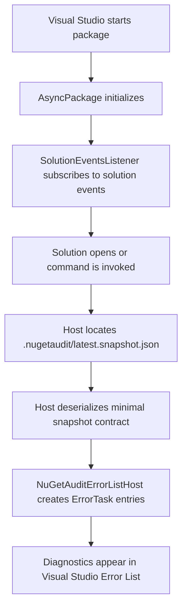
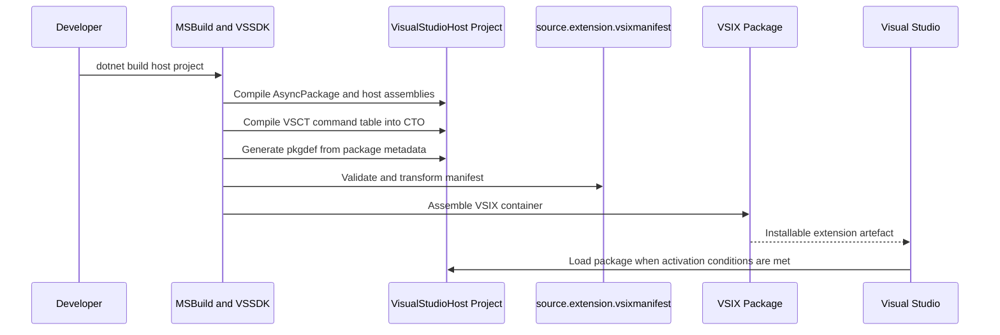
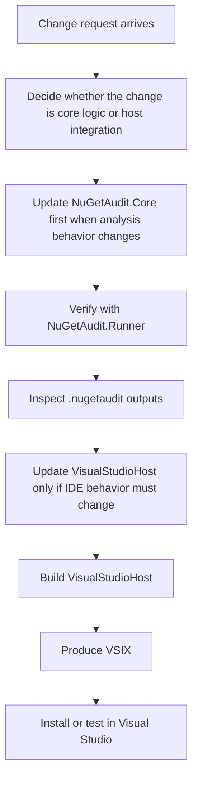
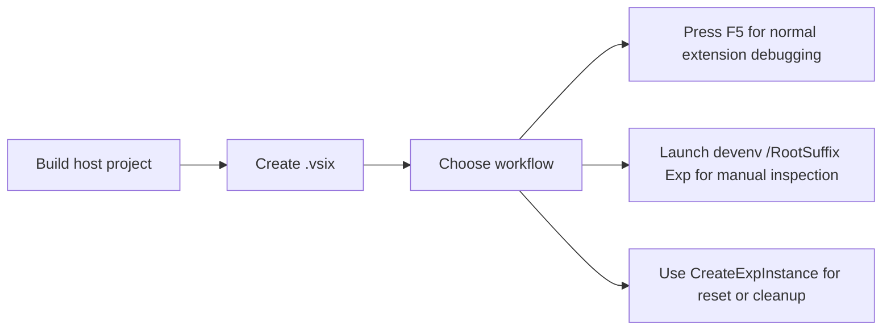

# NuGetAudit Description

## Document Control

| Field | Value |
|---|---|
| Document Title | NuGetAudit Description |
| Document Version | `2.0.0` |
| Status | Instructional Baseline |
| Owner | Repository Maintainers |
| Reviewers | TBD |
| Created | 2026-04-04 |
| Last Updated | 2026-04-04 |
| Approved By | TBD |
| Approved On | TBD |
| Repository | `C:\Users\windo\OneDrive\Documents\Development\Nuget` |
| Primary Audience | Developers with little or no extension development experience |

## Revision Log

| Version | Date | Author | Summary |
|---|---|---|---|
| `1.0.0` | 2026-04-04 | Codex | Initial project description covering pipeline, host integration, and VSIX packaging |
| `1.1.0` | 2026-04-04 | Codex | Revised to be more instructional for developers new to extension work |
| `2.0.0` | 2026-04-04 | Codex | Updated for shared presentation, workbench catalog, source identity, knowledge timeline, criticality scoring, and outbound reporting contracts |

## Reading Guide

This document is written for a developer who can read C# and basic .NET project files, but may have no Visual Studio extension experience.

Read it as an onboarding guide, not just as a system summary.

By the end, you should understand:

1. what problem the solution solves
2. what each project in the solution is responsible for
3. the exact order in which the runtime pipeline works
4. why extension development adds extra constraints that do not exist in ordinary class library development
5. why the Visual Studio host project and the VSIX package are both required

If you are unsure where to begin in the codebase, do not start with the extension project. Start with the shared audit pipeline first, then move outward to the Visual Studio integration.

## Product Intent

NuGetAudit is becoming a central package-auditing system, not just a one-shot report generator. Its job is to answer a practical engineering question:

"What NuGet packages are actually in this codebase, how did they get there, what did we know about them at the time, what do we know now, and which of them need attention urgently?"

To answer that properly, the solution has to do more than read package names from project files. It must:

- discover which projects belong to the solution
- read direct package declarations from those projects
- inspect the restore output to understand resolved and transitive packages
- enrich the package list with package health data from nuget.org
- preserve a point-in-time package graph snapshot
- preserve later knowledge about those package versions when vulnerabilities, deprecations, or remediations become known
- compare the current result with a previous accepted snapshot
- keep a timeline of what changed and when it changed
- group identical source code cloned in multiple locations under one source identity
- calculate criticality so the same data can drive local UX, reporting, and future alerting
- write the results to disk in a repeatable form
- surface the same analysis in a standalone workbench and inside Visual Studio
- prepare structured outputs for future HTTP and SQL reporting

The current implementation is intentionally split into a shared analysis engine, a shared presentation layer, and multiple delivery surfaces:

- a command-line runner for direct execution and local verification
- a standalone workbench for audit execution, catalog management, history, and central issue review
- a Visual Studio extension host that reads generated diagnostics and presents the same shared surface inside Visual Studio

That separation matters because package analysis, presentation, and host integration are different concerns:

- `NuGetAudit.Core` owns analysis, snapshots, deltas, knowledge, and persistence
- `NuGetAudit.Presentation` owns reusable UI controls and presentation-facing contracts
- `NuGetAudit.Workbench` owns central desktop workflow
- `NuGetAudit.VisualStudioHost` owns Visual Studio lifecycle, commands, tool windows, and VSIX packaging
- `NuGetAudit.Intelligence` owns criticality and transport-friendly reporting contracts

This matches Microsoft's general extension guidance: Visual Studio extensions commonly extend commands, tool windows, editors, projects, and other IDE features through extension-specific models rather than through ordinary application code alone. Source: [Start developing extensions in Visual Studio](https://learn.microsoft.com/en-us/visualstudio/extensibility/starting-to-develop-visual-studio-extensions?view=visualstudio)

## Runtime Story

The practical runtime path starts with one or many solution or project paths and ends with several categories of output:

- persisted artefacts in `.nugetaudit`
- a mutable knowledge timeline in SQLite
- central workbench views across many tracked sources
- optionally surfaced diagnostics and explorer UI inside Visual Studio
- future-ready structured reporting batches for HTTP or SQL sinks

The easiest way to understand the system is to think of it as four layers.

The first layer is the audit layer. That layer is responsible for discovering projects, analysing package state, enriching the results, writing snapshot/report files, and maintaining package knowledge over time.

The second layer is the intelligence layer. That layer is responsible for criticality scoring and the structured contracts that future upstream reporting and alerting will use.

The third layer is the presentation layer. That layer is responsible for reusable tree, graph, table, and history controls so the workbench and Visual Studio do not each implement their own UI logic.

The fourth layer is the host layer. That layer is responsible for taking the already-generated analysis results and presenting them either in the standalone workbench or inside Visual Studio.

For a developer new to extensions, this is the key mental model:

- `NuGetAudit.Core` creates and persists the truth
- `NuGetAudit.Intelligence` gives that truth prioritisation and transport shape
- `NuGetAudit.Presentation` gives that truth a reusable UI surface
- `NuGetAudit.Workbench` and `NuGetAudit.VisualStudioHost` host the same surface in different environments



## Component Responsibilities

| Component | Responsibility | Inputs | Outputs | Notes |
|---|---|---|---|---|
| `NuGetAudit.Core` | Shared audit engine and domain model | Solution path, project files, assets files, NuGet metadata, output options | `SolutionSnapshot`, `SnapshotDelta`, diagnostics, Markdown and JSON artefacts | Contains nearly all business logic |
| `NuGetAudit.Intelligence` | Criticality scoring and generic reporting contracts | Package health, reach, remediation, history context | `CriticalityAssessment`, outbound reporting records | Designed to remain usable beyond NuGet |
| `NuGetAudit.Presentation` | Shared presentation controls and contracts | Snapshot, history, knowledge, and graph payloads | Explorer, history, and shared UI controls | Keeps Workbench and Visual Studio aligned |
| `NuGetAudit.Runner` | Command-line entry point | CLI args and a solution path | Console summary and a call into `NuGetAudit.Core` | Best surface for local validation |
| `NuGetAudit.Workbench` | Central desktop workflow and catalog | One or many solution/project roots | Audit execution, catalog, issue rollup, history, graph, report preview | Best surface for central auditing |
| `NuGetAudit.VisualStudioHost` | Visual Studio package, tool window, and Error List integration | Visual Studio services plus `.nugetaudit` artefacts | Shared explorer/history UI, Error List tasks, installable VSIX | Thin host layer by design |
| `SolutionDiscovery` | Reads `.sln` or `.slnx` and enumerates supported project files | Solution file | `ProjectDescriptor` records | Supports `.csproj`, `.vbproj`, `.fsproj` |
| `ProjectAnalyser` | Builds one project snapshot | Project file, `packages.config`, central package props, `project.assets.json` | `ProjectSnapshot` and package records | Falls back when richer evaluation is unavailable |
| `MsBuildProjectEvaluator` | Resolves conditional `PackageReference` items accurately | Project path plus MSBuild runtime | Evaluated direct package references | Used before XML fallback |
| `ProjectAssetsParser` | Extracts resolved and transitive graph data | `obj\project.assets.json` | Resolved package records, parent relationships, dependency paths | This is where transitive mechanics become visible |
| `PackageHealthEnricher` | Calls nuget.org registration APIs | Package IDs and target frameworks | Health metadata and diagnostics | Produces vulnerability, deprecation, obsolete, and outdated signals |
| `SnapshotStore` | Persists generated artefacts | Current snapshot, delta, knowledge snapshot, options | Snapshot JSON, delta JSON, Markdown, latest pointers, knowledge JSON, SQLite path | Forms the handoff boundary to hosts and future reporting |
| `PackageKnowledgeSqliteStore` | Stores mutable knowledge over time | Snapshot, knowledge changes, remediation updates | `knowledge.timeline.db` | Separates evolving knowledge from immutable snapshots |
| `AuditCatalogStore` | Stores tracked audit roots in the workbench | Discovered paths and source identity | Central catalog JSON | Prevents duplicate registration of the same target |
| `SourceCodeIdentityResolver` | Normalises code origin identity | Disk path and optional Git metadata | Source identity key and metadata | Groups multiple clones of the same repo |
| `NuGetAuditErrorListHost` | Publishes diagnostics inside Visual Studio | Snapshot diagnostics from JSON | `ErrorTask` items in the Error List | Keeps the host-side contract intentionally minimal |

## Collaboration Sequence

The core projects work together as a staged pipeline. The earlier stages gather declaration and resolution data, the middle stages enrich and normalise it, and the later stages persist and present it.



The important design decision here is that the Visual Studio project is not the source of truth for package analysis. The source of truth is the persisted snapshot produced by the shared core. That keeps the host layer thin and easier to maintain.

## Shared Engine Mechanics

`NuGetAuditRunner` in [src/NuGetAudit.Core/NuGetAuditRunner.cs](C:/Users/windo/OneDrive/Documents/Development/Nuget/src/NuGetAudit.Core/NuGetAuditRunner.cs) is the orchestration point. Its job is not to analyse packages directly. Instead, it coordinates the order:

1. normalise inputs and output directory
2. compute a stable solution identity
3. discover project files
4. analyse each project in a deterministic order
5. enrich package records with external health metadata
6. aggregate warnings and diagnostics
7. compute the snapshot hash and overall status
8. load the latest accepted snapshot
9. calculate the delta
10. write the current artefacts

This order matters. Direct and resolved package data must exist before health enrichment. Health enrichment must exist before diagnostics. Diagnostics and packages must exist before persistence. Persistence must complete before the Visual Studio host can show the results.



Two implementation details are especially important for a graduate developer:

- The project file alone is not enough. It tells you what was requested, but not what the restore graph actually resolved.
- The assets file alone is not enough. It tells you resolved graph shape, but not necessarily the developer's original declaration intent or central package management context.

That is why the analyser merges multiple sources instead of trusting a single file.

## Resolution and Analysis Narrative

The project analyser combines several techniques in order of fidelity.

`MsBuildProjectEvaluator` is attempted first. This is used because conditional `PackageReference` items can be misleading when read as plain XML. MSBuild evaluation resolves conditions and per-target-framework items in a more realistic way.

If MSBuild evaluation cannot run, the code falls back to plain XML parsing of:

- `PackageReference` items inside the project file
- `packages.config` for legacy project styles
- `Directory.Packages.props` through `DirectoryPackagesPropsContext`

After direct declarations are understood, `ProjectAssetsParser` reads `obj\project.assets.json` to identify:

- resolved versions
- direct versus transitive packages
- dependency parent relationships
- one dependency path per package
- target framework scope

This is the crucial point where the implementation moves from "what the developer asked for" to "what restore produced".

## Persistence and Handoff Mechanics

The persistence layer is more important than it first appears. `SnapshotStore` now writes two classes of data.

The first class is immutable evidence:

- a timestamped snapshot JSON file
- a timestamped delta JSON file when enabled
- a timestamped Markdown report when enabled
- a timestamped knowledge JSON export

It also writes stable pointer files:

- `latest.snapshot.json`
- `latest.accepted.snapshot.json`
- `latest.knowledge.json`

The second class is mutable knowledge:

- `knowledge.timeline.db`

`latest.snapshot.json` is the operational handoff file for the Visual Studio host. That file is deliberately stable and easy to locate. The host can read it without needing to understand historical naming patterns or choose between candidate snapshots.

`latest.accepted.snapshot.json` is used as the baseline for delta calculation when the current run is complete enough to be trusted.

`latest.knowledge.json` and `knowledge.timeline.db` are what let NuGetAudit do something more mature than a simple point-in-time report. A package can be acceptable on the day it is first observed and then later become vulnerable, deprecated, obsolete, or newly remediable. The original snapshot should stay historically true, while the later knowledge should still be attached and visible.

This split is one of the key design choices in the solution:

- JSON preserves historical evidence and portable artefacts
- SQLite preserves mutable, queryable package knowledge over time
- hosts read both so they can show "what we had then" and "what we know now"

## Extension and Host Mechanics

The Visual Studio project exists because Visual Studio does not load arbitrary class libraries as extensions.

This is one of the most important beginner concepts in the repository.

If you build a normal `.dll`, Visual Studio does not automatically know:

- that the assembly is meant to be an extension
- when it should be loaded
- what commands it provides
- what services it needs
- how it should be installed

Visual Studio instead expects an extension package that participates in the Visual Studio host lifecycle, declares itself through package metadata, and is delivered in a VSIX container. Microsoft documents VSIX as the normal package used to distribute and install Visual Studio extensions. Source: [Start developing extensions in Visual Studio](https://learn.microsoft.com/en-us/visualstudio/extensibility/starting-to-develop-visual-studio-extensions?view=visualstudio)

The host code in [src/NuGetAudit.VisualStudioHost/NuGetAuditPackage.cs](C:/Users/windo/OneDrive/Documents/Development/Nuget/src/NuGetAudit.VisualStudioHost/NuGetAuditPackage.cs) is an `AsyncPackage`.

If you are new to extension development, think of `AsyncPackage` as the extension's entry point into the IDE. It is the object Visual Studio can load, initialize, and give access to IDE services.

Why this matters:

- it gives the extension a proper lifecycle inside Visual Studio
- it allows commands and menus to be registered
- it provides access to services such as the current solution
- it supports background loading, which helps avoid blocking the IDE unnecessarily

This matches the classic VSSDK model described by Microsoft, where VSPackages are used for extensions that use or extend commands, tool windows, and projects. Source: [Start developing extensions in Visual Studio](https://learn.microsoft.com/en-us/visualstudio/extensibility/starting-to-develop-visual-studio-extensions?view=visualstudio)

The host code in [src/NuGetAudit.VisualStudioHost/SolutionEventsListener.cs](C:/Users/windo/OneDrive/Documents/Development/Nuget/src/NuGetAudit.VisualStudioHost/SolutionEventsListener.cs) subscribes to solution events.

When a solution opens, it looks for `.nugetaudit\latest.snapshot.json` relative to the solution path. If the snapshot exists, it hands it to `NuGetAuditErrorListHost`, which reads the minimal contract in [src/NuGetAudit.VisualStudioHost/NuGetAuditSnapshotContracts.cs](C:/Users/windo/OneDrive/Documents/Development/Nuget/src/NuGetAudit.VisualStudioHost/NuGetAuditSnapshotContracts.cs) and converts those diagnostics into `ErrorTask` entries.

This design is instructional because it shows a safe extension pattern:

- let shared code do the heavy work
- let the host react to IDE events
- let the host translate persisted results into IDE-visible UI

The reason this is a separate host project is not cosmetic. It is required because:

- Visual Studio services such as `SVsSolution`, `IMenuCommandService`, and `ErrorListProvider` only exist inside the IDE process
- extension packages must respect UI-thread rules for service access and disposal
- commands and menus are declared through Visual Studio command table resources
- installation requires a VSIX package, not just a compiled DLL

The beginner takeaway is:

- shared engine code should stay outside the host when possible
- host code should focus on Visual Studio concerns
- packaging concerns belong to the host project because that is the installable extension boundary

### The extension model this repository is using

This repository is using the classic VSSDK extension model, not the newer `VisualStudio.Extensibility` model.

That distinction matters because Microsoft currently documents two different extension approaches:

- classic VSSDK extensions
  These typically use `AsyncPackage`, VSIX manifests, VSCT command tables, and Visual Studio services inside the IDE process.
- `VisualStudio.Extensibility` extensions
  Microsoft documents these as using `VisualStudio.Extensibility`, and the quickstart explicitly says the extension runs out-of-process, meaning outside of the Visual Studio process, and requires Visual Studio 2022 17.9 Preview 1 or higher.

Our codebase clearly matches the classic VSSDK model because it uses:

- `AsyncPackage`
- `ProvideAutoLoad`
- `ProvideMenuResource`
- `ErrorListProvider`
- `source.extension.vsixmanifest`
- `.vsct` command metadata

So when you read Visual Studio extension documentation, make sure you are reading the documentation for the same extension model. The `VisualStudio.Extensibility` quickstart is still useful background, especially for understanding the experimental instance and F5 debugging flow, but it is not the API model this repository is built on. Sources: [Start developing extensions in Visual Studio](https://learn.microsoft.com/en-us/visualstudio/extensibility/starting-to-develop-visual-studio-extensions?view=visualstudio), [Create your first Visual Studio extension](https://learn.microsoft.com/en-us/visualstudio/extensibility/visualstudio.extensibility/get-started/create-your-first-extension?view=visualstudio)



## Packaging and Delivery Mechanics

The extension is installable because the Visual Studio host project now produces a VSIX.

If you are new to extension development, treat the VSIX as the extension equivalent of an installer package. It is the thing Visual Studio installs, discovers, and loads from. Microsoft's extension overview also points to VSIX as the standard way to send or install an extension on another machine. Source: [Start developing extensions in Visual Studio](https://learn.microsoft.com/en-us/visualstudio/extensibility/starting-to-develop-visual-studio-extensions?view=visualstudio)

The important ingredients are:

- the package class
- the command table resource (`.vsct`)
- the extension manifest (`source.extension.vsixmanifest`)
- the VSSDK build targets and package generation steps

The manifest identifies the extension, its target Visual Studio versions, required architecture, prerequisites, and packaged assets. The VSSDK tooling generates intermediate artefacts such as the `.cto`, `.pkgdef`, and final `extension.vsixmanifest`, then packages them with the assembly into `NuGetAudit.VisualStudioHost.vsix`.

For a beginner, the order here is more important than the file names:

1. compile the host assembly
2. compile the command metadata from the `.vsct` file
3. generate package registration metadata
4. validate and transform the extension manifest
5. assemble the `.vsix`

That order explains why a plain successful DLL build is not enough. Extension packaging is a second concern layered on top of code compilation.

The host project is therefore doing two different jobs:

- building host integration code that Visual Studio can load
- producing an installable container that Visual Studio can discover and install

Without the host project, the IDE would have no package to load. Without the VSIX, there would be no supported deployment unit.

Another way to say this is:

- `NuGetAudit.Core` gives you the capability
- `NuGetAudit.VisualStudioHost` gives you the host integration
- the VSIX gives you the installable product



## Design Tensions and Sharp Edges

Several parts of this solution are more subtle than ordinary .NET application development.

- MSBuild evaluation versus plain XML parsing
  Why this surprises people:
  New developers often assume the project file text is the whole truth.
  Why it matters:
  Conditional `PackageReference` items can make raw XML incomplete or misleading.
  How to work safely:
  Prefer the evaluated view first and treat plain XML parsing as a fallback.

- Requested version versus resolved version
  Why this surprises people:
  It feels like "the version in the project file" should be enough.
  Why it matters:
  The project file shows what was asked for, but `project.assets.json` shows what restore actually produced.
  How to work safely:
  Use both sources whenever you are reasoning about package state.

- Thin host contract
  Why this surprises people:
  New extension developers often expect the Visual Studio project to contain the whole feature.
  Why it matters:
  The host only reads persisted diagnostics and publishes them into the IDE.
  How to work safely:
  Debug the core output first, then debug the IDE presentation layer.

- UI thread affinity
  Why this surprises people:
  Ordinary .NET code often does not care which thread touches an object.
  Why it matters:
  Some Visual Studio services do care, and misuse can cause runtime issues or analyzer warnings.
  How to work safely:
  Switch to the main thread before using thread-affine IDE services and be careful during disposal.

- VSIX packaging is not the same as ordinary class library build output
  Why this surprises people:
  A successful build usually feels like "the work is done".
  Why it matters:
  An extension also needs validated manifest metadata and a VSIX container.
  How to work safely:
  Always verify the `.vsix` output, not just the `.dll`.

- Visual Studio targeting rules change over time
  Why this surprises people:
  Extension manifests look static until a newer SDK starts validating extra fields.
  Why it matters:
  Missing values such as architecture or prerequisites can break packaging.
  How to work safely:
  Treat the VSIX manifest as a first-class maintained file.

- The current integration boundary is file based
  Why this surprises people:
  Developers may expect the host to invoke the analysis engine directly.
  Why it matters:
  The current design depends on `.nugetaudit\latest.snapshot.json` being present.
  How to work safely:
  Confirm the snapshot file exists and contains the expected diagnostics before debugging Visual Studio UI behavior.

## Operational Order

The right development order for this repository is:

1. Start in `NuGetAudit.Core` when the change concerns package discovery, resolution, enrichment, snapshot content, or reporting.
2. Use `NuGetAudit.Runner` to verify the change end-to-end because it exercises the core pipeline without Visual Studio packaging complexity.
3. Confirm the `.nugetaudit` outputs are correct before modifying the Visual Studio host.
4. Touch `NuGetAudit.VisualStudioHost` only for IDE integration concerns such as commands, lifecycle, Error List publication, and packaging.
5. Rebuild the host project and confirm the VSIX is generated.
6. Install or test the VSIX in Visual Studio when the change affects host behaviour.

This order matters for a beginner because it keeps you from debugging the wrong layer.

Use this quick rule:

- if the package data is wrong, start in the core project
- if the files are right but Visual Studio shows nothing, start in the host project
- if the host builds but the extension cannot be installed, start in the packaging and manifest configuration



This order is important because it keeps ordinary analysis debugging separate from extension-host debugging. If a developer jumps into the Visual Studio project too early, they can waste time debugging packaging or host lifecycle issues when the actual defect is in the shared analysis layer.

## Validation Record

| Check | Command or Action | Result | Notes |
|---|---|---|---|
| Core understanding | Read orchestration and parsing classes | Complete | Based on current repository state |
| Host understanding | Read package, listener, and Error List host classes | Complete | Based on current repository state |
| Packaging understanding | Build `src\NuGetAudit.VisualStudioHost\NuGetAudit.VisualStudioHost.csproj` | Pass | Produces `NuGetAudit.VisualStudioHost.vsix` |
| Warning cleanup | Rebuild host after disposal fix | Pass | Current host build is clean |

## Experimental Visual Studio Installation

If you are learning extension development, use the experimental instance first.

The experimental instance is a separate Visual Studio profile selected with `/RootSuffix Exp`. It lets you test extension behavior in an isolated environment without changing your normal Visual Studio profile. Microsoft documents `/RootSuffix` as the switch used to start Visual Studio by using an alternate location for VSPackage development. Source: [Devenv Command-Line Switches for VSPackage Development](https://learn.microsoft.com/en-us/visualstudio/extensibility/devenv-command-line-switches-for-vspackage-development?view=visualstudio)

The important correction is this:

- `VSIXInstaller.exe` does not install to a specific root suffix such as `Exp`
- `/RootSuffix Exp` is a `devenv.exe` concept, not a `VSIXInstaller.exe` concept
- the experimental instance is primarily for extension development and debugging, not for VSIXInstaller targeting

The most useful beginner mental model is:

- normal Visual Studio instance = the IDE you use to write the extension
- experimental Visual Studio instance = the isolated IDE you use to run and debug the extension
- VSIX file = the installable extension package

These three things are related, but they are not interchangeable.

If you only remember one rule from this section, remember this one:

- `F5` is for development
- `devenv /RootSuffix Exp` is for manually opening the experimental environment
- `CreateExpInstance` is for creating or resetting that environment
- `VSIXInstaller.exe` is for actual VSIX installation targets, not for targeting `Exp`

### The safest day-to-day workflow

For ordinary extension development, the recommended workflow is not "manually install the VSIX into Exp".

It is:

1. open the solution in your normal Visual Studio instance
2. make code changes there
3. press `F5` on the VSIX/host project
4. let Visual Studio launch the experimental instance for you
5. test the extension in that experimental instance

This is the workflow Microsoft recommends for VSIX-based development. Microsoft states that every application that has a VSIX package launches the Visual Studio experimental instance in debug mode. That means the normal extension-authoring path is to debug into the experimental instance rather than trying to target it with `VSIXInstaller.exe`.  
Source: [The Experimental Instance](https://learn.microsoft.com/en-us/visualstudio/extensibility/the-experimental-instance?view=visualstudio)

### When to use `devenv.exe /RootSuffix Exp`

Use `devenv.exe /RootSuffix Exp` when you want to open the experimental instance directly, outside a specific F5 session.

That is helpful when:

- you want to inspect the experimental environment
- you want to verify whether prior extension state is still present
- you want to test behavior without starting from the debugger
- you want to confirm whether a problem is tied to debugging or to the extension itself

Microsoft documents this form explicitly for starting the experimental instance manually.  
Source: [The Experimental Instance](https://learn.microsoft.com/en-us/visualstudio/extensibility/the-experimental-instance?view=visualstudio)

### When to use `CreateExpInstance`

Use `CreateExpInstance` when the experimental environment itself needs to be created, reset, or cleaned.

That is helpful when:

- the experimental instance has become polluted by previous test runs
- cached configuration is causing confusing behavior
- you need a clean extension test environment
- you want to remove the experimental instance and recreate it from scratch

Microsoft documents `CreateExpInstance.exe` for `/Create`, `/Reset`, and `/Clean`.  
Source: [CreateExpInstance Utility](https://learn.microsoft.com/en-us/visualstudio/extensibility/internals/createexpinstance-utility?view=vs-2022)

Use this order:

1. build the host project so the VSIX exists
2. decide whether you are doing normal debugging or environment maintenance
3. for normal debugging, press `F5` from the host project
4. for manual inspection, launch Visual Studio with `/RootSuffix Exp`
5. for cleanup/reset, use `CreateExpInstance`



Use these commands to work with the experimental instance:

```powershell
dotnet build src\NuGetAudit.VisualStudioHost\NuGetAudit.VisualStudioHost.csproj
Start-Process -FilePath "C:\Program Files\Microsoft Visual Studio\18\Community\Common7\IDE\devenv.exe" -ArgumentList @("/RootSuffix", "Exp")
```

If the experimental instance needs to be reset, use the Visual Studio SDK experimental-instance tooling or the built-in experimental-instance commands from Visual Studio.

Typical reset pattern:

```powershell
Start-Process -FilePath "C:\Program Files\Microsoft Visual Studio\18\Community\VSSDK\VisualStudioIntegration\Tools\Bin\CreateExpInstance.exe" -ArgumentList @("/Reset", "/VSInstance=18.0", "/RootSuffix=Exp") -Wait
```

On this machine, `CreateExpInstance.exe` is located at:

`C:\Program Files\Microsoft Visual Studio\18\Community\VSSDK\VisualStudioIntegration\Tools\Bin\CreateExpInstance.exe`

Do not use this unsupported form:

```powershell
VSIXInstaller.exe /rootSuffix Exp ...
```

### The practical difference between debugging and installation

This distinction is the part most newcomers get wrong.

Debugging into the experimental instance means:

- Visual Studio launches a special experimental profile
- the extension runs there for development and testing
- the goal is safe iteration while you are still building the extension

Installing a VSIX means:

- you are packaging the extension for an actual Visual Studio instance
- the installer targets installed products or instances
- this is a deployment concern, not the normal F5 debugging concern

So the rule of thumb is:

- use `F5` when you are developing
- use `devenv /RootSuffix Exp` when you want to inspect or manually run the experimental instance
- use `CreateExpInstance` when the experimental environment needs cleanup
- use `VSIXInstaller.exe` when you are installing the extension into an actual Visual Studio target, not when you are trying to target `Exp`

When debugging, use this simple guide:

- if the experimental instance opens but the extension behavior is missing, inspect the host layer
- if the host looks fine, inspect `.nugetaudit\latest.snapshot.json`
- if the VSIX builds but debugging does not behave correctly in the experimental instance, inspect the Visual Studio debug/start settings and experimental-instance setup

## Follow-On Work

- Move more of the central issue rollup and source-grouped views into the shared presentation layer so both hosts expose the same central-auditing experience.
- Add structured outbound publishers that implement the new reporting contracts for HTTP and SQL.
- Add policy/configuration so criticality weighting, alert thresholds, and production relevance can be tuned without code changes.
- Extend source identity to understand forks and upstream relationships as a stretch goal.
- Rewrite the remaining older sections of this document so every example and diagram reflects the multi-root central-auditing model end to end.

## Sources

If you want to read only one Microsoft page first, use:

- [Start developing extensions in Visual Studio](https://learn.microsoft.com/en-us/visualstudio/extensibility/starting-to-develop-visual-studio-extensions?view=visualstudio)
  Use this for the broad conceptual model of Visual Studio extensions, VSIX packaging, and classic VSSDK terminology.

If you want to understand why some modern samples look different from this repository, use:

- [Create your first Visual Studio extension](https://learn.microsoft.com/en-us/visualstudio/extensibility/visualstudio.extensibility/get-started/create-your-first-extension?view=visualstudio)
  Use this to understand the newer `VisualStudio.Extensibility` model and why it differs from the `AsyncPackage`-based approach used here.

If you want to manage the experimental instance itself, use:

- [CreateExpInstance Utility](https://learn.microsoft.com/en-us/visualstudio/extensibility/internals/createexpinstance-utility?view=vs-2022)
  Use this for creating, resetting, and cleaning the experimental instance.

The extension-specific guidance in this document has been checked against the following sources:

- Microsoft Learn: [Start developing extensions in Visual Studio](https://learn.microsoft.com/en-us/visualstudio/extensibility/starting-to-develop-visual-studio-extensions?view=visualstudio)
  This confirms the main VSSDK extension categories, the role of VSPackages and MEF extensions, the need for the Visual Studio SDK, and that VSIX is the normal distribution package.
- Microsoft Learn: [Create your first Visual Studio extension](https://learn.microsoft.com/en-us/visualstudio/extensibility/visualstudio.extensibility/get-started/create-your-first-extension?view=visualstudio)
  This confirms that the newer `VisualStudio.Extensibility` quickstart is an out-of-process model and that pressing `F5` deploys to the experimental instance. It is useful for understanding workflow, but it is not the same API model this repository uses.
- Microsoft Learn: [CreateExpInstance Utility](https://learn.microsoft.com/en-us/visualstudio/extensibility/internals/createexpinstance-utility?view=vs-2022)
  This confirms that `CreateExpInstance.exe` is the supported tool for creating, resetting, and cleaning experimental instances.

The Medium article you provided was reviewed as supplementary reading only:

- [Building Your Visual Studio Extension: A Step-by-Step Guide](https://osman-koc.medium.com/building-your-visual-studio-extension-a-step-by-step-guide-e58db07971a8)

Where Microsoft Learn and the Medium article differ in emphasis, this document follows Microsoft Learn.
