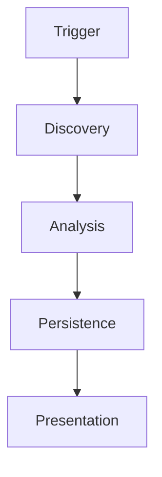
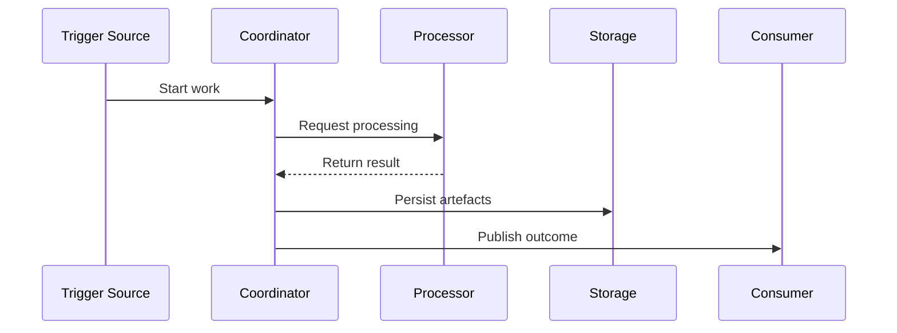
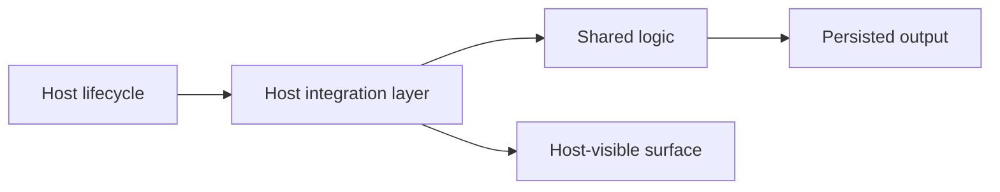

# Description Template

## Document Control

| Field | Value |
|---|---|
| Document Title | |
| Document Version | `0.1.0` |
| Status | Draft |
| Owner | |
| Reviewers | |
| Created | |
| Last Updated | |
| Approved By | |
| Approved On | |
| Repository | |
| Primary Audience | |

## Revision Log

| Version | Date | Author | Summary |
|---|---|---|---|
| `0.1.0` | YYYY-MM-DD | | Initial template created |

## Reading Guide

State who should read this document, what background is assumed, and what outcome the reader should achieve after finishing it.

Write this section for someone who may be new to the host platform. Be explicit about assumed knowledge. If the document is meant to onboard developers, say so directly.

## Product Intent

Describe the business or engineering problem, the operating boundary, and the outcome the solution is meant to create.

Do not assume the reader already understands the product category. Explain the real-world purpose in plain language before introducing implementation terms.

## Runtime Story

Narrate the runtime path in order from trigger to output. Keep this section prose-first so the reader can understand the flow before studying diagrams.

Use teaching language. Explain:

- what starts the work
- what happens next
- what data is created
- what later stages depend on earlier stages
- what the user eventually sees

## Component Responsibilities

List each project, service, or major module and explain its responsibility, its inputs, and its outputs.

Prefer beginner-friendly descriptions over shorthand. If a component is a host-specific adapter, say that clearly.

| Component | Responsibility | Inputs | Outputs | Notes |
|---|---|---|---|---|
| | | | | |

## Collaboration Sequence

Explain the collaboration order between components and what data is exchanged at each hand-off.

After the diagram, add a short prose walkthrough that teaches the order in plain language.

## Extension and Host Mechanics

Use this section when the solution runs inside a host such as Visual Studio, VS Code, Office, or a browser runtime. Explain the host boundary, lifecycle constraints, and why the host-specific project exists.

Assume the reader has never built an extension before. Explain:

- why a normal class library is not enough
- what the host-specific project does
- what the host controls
- what the shared code controls
- where threading, lifecycle, and service access become important

## Packaging and Delivery Mechanics

Explain the packaging model, the artefacts that are produced, how versioning is applied, and what the installable output is.

Include the order of packaging steps, not just the result. A new developer should understand what is compiled, what is generated, and what is finally installed.

## Operational Order

Describe the order a graduate developer should follow when modifying or extending the solution. Cover setup, implementation, validation, packaging, and host verification.

This section should read like practical coaching. Explain why the order matters so a junior developer does not start in the wrong layer.

1. Confirm the execution boundary and the user-visible outcome.
2. Update shared logic first when the change is host-agnostic.
3. Update the host layer only for integration, lifecycle, and UX concerns.
4. Validate persisted outputs before validating host presentation.
5. Build the installable package and test it in the target host.

## Design Tensions and Sharp Edges

Capture the tricky parts, unusual constraints, and common mistakes. Examples:

- Threading or host affinity rules
- Background work coordination
- Serialization contract stability
- Packaging quirks
- Version targeting constraints
- Tooling assumptions

For each important sharp edge, explain:

- what it is
- why it surprises people
- how to work safely with it

## Validation Record

Record the commands, environments, and outputs used to confirm the system still behaves correctly.

| Check | Command or Action | Result | Notes |
|---|---|---|---|
| Build | | | |
| Packaging | | | |
| Host verification | | | |

## Follow-On Work

List future improvements, deferred decisions, and open technical questions.
