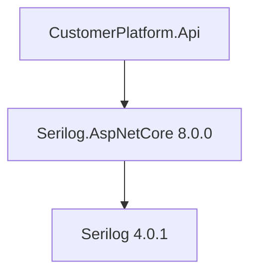
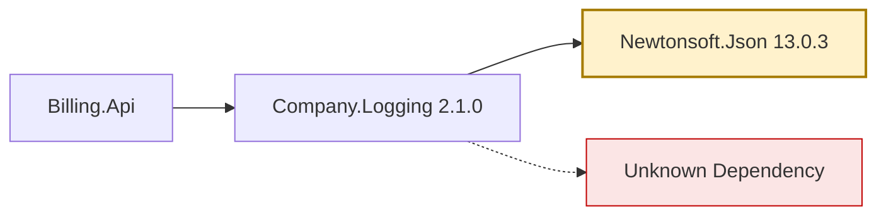
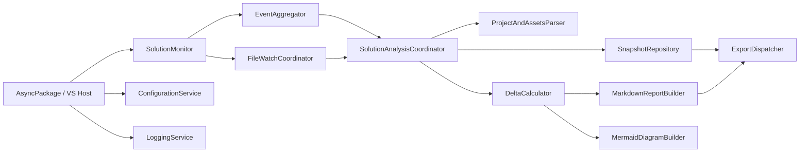
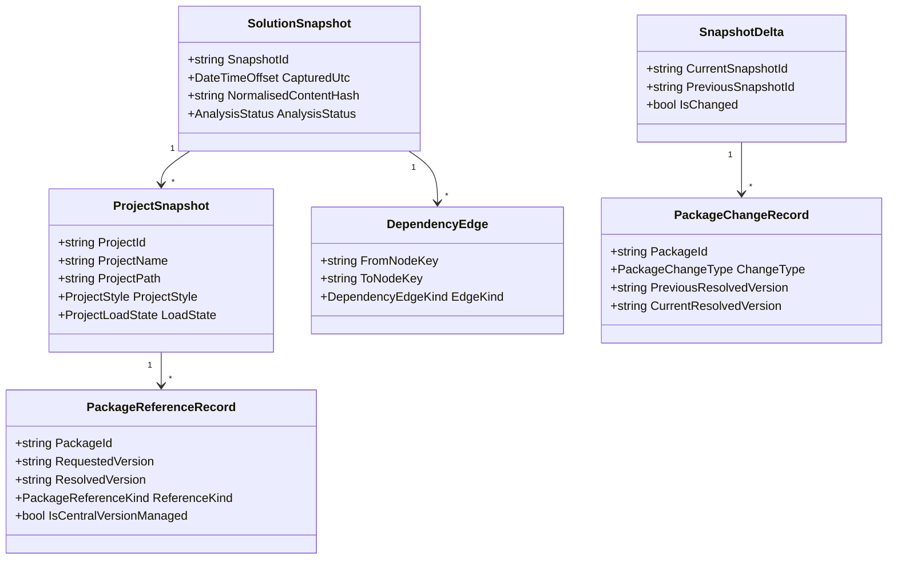
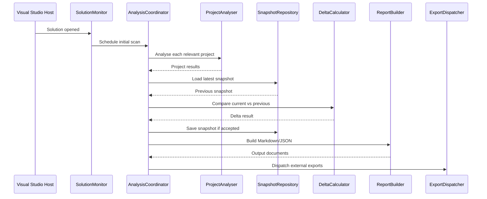

# NuGet Solution Package Audit Extension for Visual Studio

## 1. Design

### 1.1 Purpose and scope

This specification defines a Visual Studio extension that detects, understands, records, and reports NuGet package usage across an entire Visual Studio solution. The extension is intended primarily for Visual Studio 2022, should remain compatible with Visual Studio 2026 if the 2022 SDK and packaging model remain forward-compatible, and may support Visual Studio 2019 only where that support is technically and commercially justified.

The extension must:

- Discover package usage across all relevant projects in a solution.
- Distinguish direct references from transitive dependencies.
- Persist historical snapshots and calculate deltas over time.
- Generate a Markdown report locally.
- Optionally emit machine-readable data and send outputs to external destinations.
- Operate safely inside the Visual Studio host without degrading the IDE experience.

This is an implementation-oriented specification. It is written so that a senior developer can build from it, while remaining understandable to someone new to Visual Studio extensibility.

### 1.2 Recommended product position

The recommended product position is:

- Primary target: Visual Studio 2022.
- Secondary target: Visual Studio 2026, if 2022-compatible VSIX deployment remains supported.
- Optional target: Visual Studio 2019 only via a separate build/package with shared core code.

Recommended delivery strategy:

| Option | Recommendation | Reason |
|---|---|---|
| One VSIX for VS 2019, 2022, 2026 | Not recommended | SDK baselines, host runtime assumptions, package registration, and testing burden become unnecessarily complex |
| Separate VSIX packages with shared core code | Recommended if VS 2019 support is required | Keeps core logic reusable while isolating host-specific integration |
| Shared code with version-specific host layers | Strongly recommended | Best balance of maintainability and compatibility |
| Drop VS 2019 support | Recommended unless there is a hard business requirement | Simplifies architecture, testing, packaging, and future support materially |

The remainder of this specification assumes:

- The preferred baseline product is Visual Studio 2022.
- A future Visual Studio 2026-compatible package can likely be produced with minimal host-layer changes.
- Visual Studio 2019 support is optional and should be treated as a separate delivery track.

### 1.3 Architectural goals

The extension must be designed around the following goals:

- Correctness before immediacy.
- Minimal impact on Visual Studio responsiveness.
- Incremental scanning where possible.
- Clear separation between host integration and core package-analysis logic.
- Strongly typed internal models.
- Auditability of historical state and export behaviour.
- Deterministic output for change tracking.
- Graceful degradation when APIs, project systems, or metadata are incomplete.

### 1.4 Non-goals

The extension is not intended to:

- Replace NuGet restore, NuGet Package Manager, or the build system.
- Guarantee perfect real-time awareness of every package change before restore has completed.
- Support every third-party or proprietary project system with full fidelity.
- Modify project files automatically.
- Become a full dependency governance platform in its first release.

---

## 1. Design

### 1.5 Solution and project coverage

#### 1.5.1 In-scope project styles

The extension should support the following as first-class scenarios:

| Project/scenario | Support level | Notes |
|---|---|---|
| SDK-style `.csproj` with `PackageReference` | Full | Primary scenario |
| Non-SDK-style `.csproj` with `PackageReference` | High | Supported if the project system exposes restore outputs and project file access |
| Legacy `.csproj` with `packages.config` | Medium | Requires separate parsing/resolution path |
| Central Package Management via `Directory.Packages.props` | High | Supported for requested-version analysis where present |
| Multi-targeted projects | High | Must record target-framework-specific resolution where available |
| Solution folders | Structural only | Not package-bearing themselves, but may group projects |
| Unloaded projects present in `.sln` | Partial | Analyse from disk where feasible |
| Projects present on disk but not in the solution | Out of scope for MVP | Could be a later enhancement |
| Shared projects (`.shproj`) | Limited | Usually no independent restore identity; treat as non-package-bearing unless directly analysable metadata is found |
| Non-C# SDK-style projects with NuGet usage, such as VB/F# | Optional | Can be supported if project file shape and restore outputs are compatible |
| Unsupported/unknown project systems | Best-effort | Record as unsupported with reason |

#### 1.5.2 Explicit support discussion

##### SDK-style `.csproj`

This is the preferred and most reliable scenario. For SDK-style projects the extension can typically obtain:

- Requested direct references from the project file.
- Central package declarations from `Directory.Packages.props`.
- Resolved dependency graphs from `project.assets.json`.
- Framework and RID-specific resolution from restore outputs.

##### Older non-SDK-style `.csproj`

These can still use `PackageReference` in some cases. Support is realistic if:

- The project can be loaded by Visual Studio.
- Restore outputs are available.
- The project file can be parsed or inspected.

The extension should support these, but with more defensive logic and more diagnostics.

##### `packages.config`

This scenario requires separate handling because:

- Direct package references come primarily from `packages.config`.
- Transitive dependency information is not represented the same way as `PackageReference`.
- Package resolution may depend more heavily on the installed package folder and package metadata.

Recommended approach:

- Treat `packages.config` as authoritative for direct references.
- Derive dependency chains from installed package metadata when feasible.
- Accept that transitive resolution may be less complete or less version-accurate than modern restore graphs.

##### Central Package Management

If `Directory.Packages.props` or related central version files are present, the extension must capture:

- Whether a package version is centrally managed.
- Requested central version.
- Project-level override if any.
- Resolved version from restore outputs.

This is important because requested version and resolved version may differ, especially with conditions or overrides.

##### Solution-level package behaviour

The extension should recognise:

- Shared `Directory.Packages.props`.
- Shared `NuGet.Config` influence where discoverable.
- Solution-level package source settings where accessible.
- Legacy `packages` folder behaviour where relevant to `packages.config`.

The solution itself is not the package owner, but it is the audit boundary and may contain shared package management artefacts.

##### Multi-targeted projects

These must be treated as potentially having:

- Different resolved transitive dependencies per target framework.
- Different asset applicability per TFM and RID.
- A single requested direct package reference that resolves differently across targets.

The model must preserve framework-specific resolution rather than flattening everything into a single project-level package list.

##### Unloaded projects

The extension should support unloaded projects in a best-effort mode by:

- Reading the `.sln` entries.
- Inspecting the project file directly from disk.
- Reading restore artefacts if available.
- Marking the project as `Unloaded` in the snapshot.

If restore outputs are absent, the extension may only capture requested direct references.

##### Unsupported project systems

Some project systems may not expose a conventional `.csproj` or may not participate in the normal NuGet restore graph. These should be:

- Marked unsupported at project level.
- Included in the report with a reason.
- Excluded from package totals where resolution is incomplete.

##### Projects present on disk but not loaded

These should be out of scope for MVP because:

- They are not part of the loaded solution state.
- Visual Studio may not be aware of them.
- Enumerating arbitrary directories increases cost and ambiguity.

A later feature could scan the solution directory recursively, but that should be an explicit user option.

##### Shared projects

Shared projects generally contribute source, not independent NuGet resolution. They should be reported as:

- Present in solution.
- Not independently package-bearing, unless a concrete, supported package declaration mechanism is detected.

##### Non-C# projects

Because the implementation will be in C#, this does not limit analysis of other MSBuild-based project types. Recommended scope:

- Include SDK-style VB and F# projects if package files and restore outputs are compatible.
- Exclude project systems with incompatible metadata unless explicitly added later.

#### 1.5.3 Coverage summary recommendation

MVP must support:

- SDK-style `.csproj` with `PackageReference`.
- Non-SDK `.csproj` with `PackageReference` where restore outputs exist.
- Central Package Management.
- Multi-targeting.
- Unloaded project best-effort analysis.

Phase 2 should support:

- `packages.config`.
- Broader non-C# MSBuild project types.

Anything else should be reported clearly as unsupported rather than guessed.

### 1.6 Package identification and metadata capture

#### 1.6.1 Design principle

The extension must capture enough metadata to answer three different questions reliably:

1. What package was requested?
2. What package was actually resolved?
3. In what project/framework/context did that resolution occur?

Because no single Visual Studio or NuGet API reliably exposes all of that data across all project styles, the extension must merge data from multiple sources.

#### 1.6.2 Required, optional, and derived fields

##### Required fields

| Field | Description | Source |
|---|---|---|
| `PackageId` | NuGet package identifier | Project file, `packages.config`, assets file |
| `ProjectId` | Stable internal project identity | Derived |
| `ProjectName` | Visual Studio project display name | VS project model or derived from file |
| `ProjectPath` | Full path to project file | VS solution/project model or `.sln` |
| `SolutionName` | Solution display name | VS shell |
| `SolutionPath` | Full path to `.sln` | VS shell |
| `ReferenceKind` | Direct or Transitive | Project file plus assets graph |
| `RequestedVersion` | Version/range requested by project or central management | Project file, `packages.config`, CPM |
| `ResolvedVersion` | Actual restored version | Assets file, lock file, package folder metadata |
| `SnapshotTimestampUtc` | Time snapshot was taken | Extension-generated |
| `AnalysisStatus` | Complete, Partial, Unsupported, Failed | Extension-generated |
| `StablePackageInstanceKey` | Deterministic change-tracking key | Derived |

##### Strongly recommended fields

| Field | Description | Source |
|---|---|---|
| `TargetFrameworkMoniker` | TFM or TFM-specific scope | Assets file, project file |
| `RuntimeIdentifier` | RID when relevant | Project file, assets file |
| `PlatformTarget` | x86/x64/AnyCPU/ARM etc. if applicable | Project properties |
| `IsCentralVersionManaged` | Whether CPM controls version | Project file plus `Directory.Packages.props` |
| `PrivateAssets` | Package asset flow control | Project file |
| `IncludeAssets` | Included asset types | Project file |
| `ExcludeAssets` | Excluded asset types | Project file |
| `DevelopmentDependency` | Development-only flag where accessible | Nuspec/package metadata or project metadata |
| `PackageSource` | Feed/source if accessible | Restore metadata, NuGet APIs if available |
| `PackageInstallPath` | Global packages folder or installed package path | Restore metadata, NuGet settings, package resolution |
| `DependencyParents` | Immediate parent packages for transitive items | Assets graph |
| `DependencyPath` | One or more full chains from direct to transitive | Derived from graph |
| `ProjectLoadState` | Loaded, unloaded, unsupported | VS model or derived |
| `ProjectStyle` | SDK, LegacyPackageReference, PackagesConfig, Unknown | Derived |
| `RestoreState` | Restored, stale, missing-assets, unknown | Derived |

##### Optional fields

| Field | Description | Source |
|---|---|---|
| `PackageAuthors` | Package author metadata | Nuspec/NuGet metadata |
| `PackageOwners` | If available from metadata source | NuGet metadata |
| `PackageDescription` | Descriptive metadata | Nuspec |
| `PackageLicenseExpression` | License metadata | Nuspec |
| `PackageProjectUrl` | Package URL | Nuspec |
| `NuGetConfigPath` | Effective config path if known | NuGet settings |
| `MachineName` | Machine context | Environment |
| `UserName` | User context if permitted | Environment |
| `SessionId` | Correlation/session identifier | Extension-generated |
| `GitBranchName` | Branch context if desired | Optional external integration |
| `SolutionConfiguration` | Debug/Release etc. | VS environment |
| `SolutionPlatform` | Any CPU/x64 etc. | VS environment |

##### Derived fields

| Field | Description |
|---|---|
| `StableProjectKey` | Deterministic identity for project over time |
| `StablePackageKey` | Deterministic identity for package within project/scope |
| `ChangeType` | Added/Removed/Upgrade/Downgrade/MetadataChanged |
| `VersionChangeDirection` | Upgrade/Downgrade/Lateral/Unknown |
| `ResolutionScopeKey` | Project + TFM + RID + package scope identity |
| `HashOfNormalisedState` | Used to suppress duplicate snapshots |

#### 1.6.3 Stable identity key recommendation

Recommended stable package instance key format:

```text
{NormalisedSolutionPath}|{NormalisedProjectPath}|{TargetFrameworkOrNone}|{RuntimeIdentifierOrNone}|{PackageIdUpperInvariant}
```

Recommended stable snapshot hash basis:

- Sorted project list.
- Within each project, sorted package list.
- Include only change-significant fields.
- Exclude volatile fields such as local timestamp and user session unless explicitly configured.

#### 1.6.4 What is reliably available from APIs versus disk

| Metadata | VS/NuGet APIs | Project file | Assets/lock files | Package metadata on disk | Notes |
|---|---|---|---|---|---|
| Project name/path | Reliable | Reliable | N/A | N/A | VS model preferred when loaded |
| Direct references | Sometimes | Reliable | Inferable | N/A | Project file is usually authoritative |
| Transitive dependencies | Not uniformly reliable | No | Reliable for `PackageReference` | Partial | Assets file preferred |
| Requested version | Sometimes | Reliable | Sometimes | No | Project/CPM authoritative |
| Resolved version | Sometimes | No | Reliable | Partial | Assets/lock preferred |
| Central package management | Limited | Reliable | Sometimes | No | Must inspect central props files |
| Dependency chain | Limited | No | Reliable | Partial | Build from assets graph |
| Package source/feed | Often incomplete | No | Sometimes | Sometimes | Best-effort only |
| Asset flags | Limited | Reliable | Sometimes | No | Project file authoritative |
| Author/company metadata | No | No | No | Reliable if package installed | Optional enrichment |
| Restore status | Partial | No | Reliable | Partial | Based on presence/freshness of assets |
| Package cache path | Partial | No | Sometimes | Reliable | Useful but not always critical |

#### 1.6.5 Authoritative source rules

Recommended source-of-truth rules:

- Direct requested references: project file or `packages.config`.
- Central version definition: `Directory.Packages.props` and imported central props where supported.
- Resolved version and dependency graph: `project.assets.json`.
- Lock-state verification: `packages.lock.json` when present.
- Package descriptive metadata: nuspec in global package cache or package install folder.
- Solution/project identity: Visual Studio APIs when loaded; disk files as fallback.

### 1.7 Change detection

#### 1.7.1 Core principle

Package change detection in Visual Studio cannot rely on a single event source. A robust design must combine:

- Host events.
- File change detection.
- Periodic reconciliation.
- Snapshot comparison.

#### 1.7.2 Candidate mechanisms

##### Visual Studio/NuGet-related events

Potentially useful event categories:

- Solution open/close events.
- Project add/remove/rename/load/unload events.
- Running document table save events for project files and package-related files.
- Build/restore completion-related events where available.
- NuGet package manager UI actions if observable.
- CPS project evaluation/update notifications for SDK-style projects.

These events are valuable as triggers, but they are not sufficient as the sole source of truth.

##### File system watcher approach

Monitor:

- `.csproj`
- `packages.config`
- `Directory.Packages.props`
- `Directory.Build.props`
- `Directory.Build.targets`
- `NuGet.Config` where relevant
- `project.assets.json`
- `packages.lock.json`

This is highly practical and often more reliable than relying only on VS integration points, especially across version differences.

##### Periodic reconciliation

Run a low-frequency background reconciliation scan when:

- The solution is idle.
- A burst of file changes has ended.
- The extension suspects missed events.
- Visual Studio resumes after inactivity.

##### Snapshot comparison

Ultimately, change must be recognised by comparing normalised current state to previous snapshot state. Events and watchers merely determine when to rescan.

##### Document save events

Useful to trigger early scan scheduling for:

- Project files.
- `packages.config`.
- Central package files.

However, a saved file does not guarantee restore has completed, so save-triggered analysis should often schedule a delayed or two-phase rescan.

##### Restore completion events

Where accessible, restore-completion is highly valuable because resolved transitive state is most accurate after restore. The design should attempt to hook such events, but must not depend on them exclusively.

##### Build-triggered or load-triggered analysis

These are useful because restore often occurs during build or solution load. Recommended use:

- Initial scan after solution load settles.
- Deferred scan after first successful restore/build signal.

##### Package manager UI actions

If observable, these can improve timeliness, but they should be treated as advisory only.

#### 1.7.3 Comparison of approaches

| Approach | Reliability | Timeliness | Correctness | Performance | Complexity | False positives | False negatives | Version compatibility |
|---|---|---|---|---|---|---|---|---|
| VS/NuGet events only | Medium | High | Medium | High | High | Low | High | Medium |
| File watchers only | High | High | Medium | Medium | Medium | Medium | Medium | High |
| Periodic scan only | High | Low | High | Low to Medium | Low | Low | Low | High |
| Snapshot comparison only | High | Depends on trigger | High | Medium | Low | Low | Low | High |
| Combined event + watcher + snapshot | Very high | High | High | Medium | Higher | Low | Low | High |

#### 1.7.4 Recommended approach

Recommended approach:

1. Use Visual Studio and project-system events to know when the solution context changes.
2. Use file watchers on package-related files for practical change detection.
3. Use debounce and delayed rescans to wait for restore/output stabilisation.
4. Use snapshot comparison as the final authority for determining whether a meaningful change occurred.
5. Run periodic reconciliation scans at a conservative interval while a solution is open.

This approach is recommended because it balances:

- Reliability across Visual Studio versions.
- Real-world correctness.
- Reasonable complexity.
- Good user experience.

#### 1.7.5 Recommended timing behaviour

Suggested timing rules:

- Initial solution open: schedule baseline scan after solution load and a short idle delay.
- Project file save: schedule a direct-reference refresh immediately and a resolved-state refresh after debounce.
- Assets file change: schedule resolved-state refresh after short debounce.
- Burst of changes: coalesce into one scan batch.
- Periodic reconciliation: every 5 to 15 minutes while solution remains open and monitoring is enabled.
- Manual export command: always forces on-demand scan before report generation unless user disables that behaviour.

#### 1.7.6 Thread-safety and host concerns

Watchers and background scans must never update Visual Studio UI-bound objects directly from background threads. Event capture and scan scheduling must be thread-safe, with host interactions marshalled via Visual Studio threading services.

### 1.8 Snapshot and history model

#### 1.8.1 Current-state model

The current-state model represents the most recent fully analysed solution package state. It is used for:

- UI display.
- Change comparison.
- Export/report generation.
- Deduplication against previous state.

#### 1.8.2 Snapshot model

A snapshot is an immutable record of solution package state at a point in time. It should include:

- Solution metadata.
- Project-level analysis records.
- Package references and resolutions.
- Dependency edges.
- Unsupported/scenario warnings.
- Environment metadata.
- Hash of normalised state.

Recommended snapshot storage format:

- JSON for machine-readable canonical storage.
- Markdown for human-readable reporting.

#### 1.8.3 Comparison model

A delta is calculated by comparing two snapshots:

- Previous accepted snapshot.
- New candidate snapshot.

The comparison must identify:

- Added package instances.
- Removed package instances.
- Version change on same package identity.
- Changed direct/transitive classification.
- Changed dependency parent/path.
- Changed project association.
- Changed framework-specific resolution.
- Changed central-management status.
- Changed package metadata of interest.

#### 1.8.4 Historical run storage

Recommended storage model:

- Per-solution history root.
- One machine-readable snapshot file per accepted state.
- One Markdown report per accepted change event or per requested run.
- Optional rolling index file for efficient lookup.

Recommended default location:

```text
%LocalAppData%\Company\Product\SolutionHistory\{SolutionKey}\
```

Optional configurable local output location:

```text
{SolutionDirectory}\.nuget-audit\
```

Recommended structure:

```text
SolutionHistory\
  {SolutionKey}\
    index.json
    snapshots\
      2026-04-03T09-15-12Z_{SnapshotId}.json
    reports\
      2026-04-03T09-15-12Z_{SnapshotId}.md
    exports\
      spool\
      sent\
      failed\
```

#### 1.8.5 Repeated identical states

Repeated identical states should normally not create a new persisted history entry unless configured. Recommended behaviour:

- Always compute current state.
- Compare hash with last accepted snapshot.
- If unchanged:
  - Update lightweight “last observed” metadata in index.
  - Do not write a new full snapshot by default.
- If user requests manual export:
  - Allow generation of a new Markdown report even if state is unchanged, but mark it as unchanged from previous snapshot.

#### 1.8.6 History scope

Recommended history scope hierarchy:

- Primary scope: per solution.
- Optional annotation: machine and user context.
- Optional annotation: git branch if available.
- Avoid a purely global history store because package changes are meaningfully solution-specific.

Recommended identity basis:

- Solution path-based key by default.
- Optionally allow a logical solution identifier if path mobility becomes a requirement.

#### 1.8.7 Human-readable versus machine-readable history

Recommended approach:

- JSON snapshot: canonical machine-readable storage.
- Markdown report: human-readable summary and detail.
- Optional export payloads: JSON with versioned schema.

#### 1.8.8 Delta classification rules

| Change type | Detection rule |
|---|---|
| Added package | Exists in current snapshot, absent in previous |
| Removed package | Exists in previous snapshot, absent in current |
| Upgrade | Same stable package instance key, higher resolved version |
| Downgrade | Same stable package instance key, lower resolved version |
| Requested version changed | Same package instance, requested version differs |
| Direct to transitive | Same package instance, classification changed |
| Transitive to direct | Same package instance, classification changed |
| Dependency path changed | Same resolved package but different parent chain |
| Framework-specific resolution changed | Same project/package, different per-TFM result |
| Project association changed | Package moved because project renamed/moved or project set changed |

### 1.9 Markdown report generation

#### 1.9.1 Output rules

The extension must generate Markdown and save it locally. Recommended behaviour:

- Generate one report per accepted snapshot change.
- Generate one report on manual export even if unchanged.
- Optionally generate per-project reports later, but not in MVP.

#### 1.9.2 Naming rules

Recommended file naming format:

```text
{SolutionNameSanitised}_{UtcTimestamp:yyyy-MM-dd_HH-mm-ss}_{SnapshotShortId}.md
```

Example:

```text
CustomerPlatform_2026-04-03_09-15-12_8F3A1C2D.md
```

Companion JSON file:

```text
CustomerPlatform_2026-04-03_09-15-12_8F3A1C2D.snapshot.json
```

#### 1.9.3 Folder location rules

Default local report folder should be configurable. Recommended defaults, in order:

1. User-configured explicit path.
2. Solution-relative hidden folder: `{SolutionDirectory}\.nuget-audit\reports\`
3. Local app data fallback.

#### 1.9.4 Overwrite versus versioning

Recommended behaviour:

- Never overwrite accepted historical reports by default.
- Maintain versioned output files.
- Optionally generate/update a latest pointer file:
  - `Latest.md`
  - `Latest.snapshot.json`

#### 1.9.5 Recommended report structure

The report should be readable in plain Markdown and improve when preview/rendering is available.

Recommended structure:

```markdown
# NuGet Package Audit Report

## Summary
## Solution Context
## Scan Coverage
## Change Summary
## Current Package State
## Project Details
## Transitive Dependency Highlights
## Unsupported or Partial Analysis
## Export Status
## Appendices
```

#### 1.9.6 Recommended report content

##### Summary

Include:

- Solution name/path
- Snapshot timestamp
- Total projects discovered
- Total projects analysed
- Total direct packages
- Total transitive packages
- Number of changes since previous snapshot
- Analysis completeness summary

##### Solution context

Include:

- Solution path
- Visual Studio version
- Extension version
- Machine/user context if configured
- Optional branch name
- Scan trigger reason

##### Scan coverage

Table example:

| Project | Path | Style | Load state | Analysis status | Notes |
|---|---|---|---|---|---|

##### Change summary

Table example:

| Change type | Count |
|---|---|
| Added | 4 |
| Removed | 1 |
| Upgraded | 3 |
| Downgraded | 0 |
| Metadata changed | 2 |

##### Current package state

Recommended sections:

- Direct packages by project
- Transitive packages by project or grouped under each direct package
- Framework/RID-specific notes where material

##### Project details

For each project:

| Field | Value |
|---|---|
| Project name | |
| Project path | |
| Style | |
| Target frameworks | |
| Package management style | |
| Central package management | Yes/No |
| Analysis status | |

Direct packages table:

| Package ID | Requested | Resolved | Source | TFM | CPM | Assets flags | Notes |
|---|---|---|---|---|---|---|---|

Transitive packages table:

| Package ID | Resolved | Parent package(s) | TFM | Path summary | Notes |
|---|---|---|---|---|---|

##### Warnings and unsupported scenarios

Explicit section with:

- Unloaded projects analysed partially.
- Projects skipped due to unsupported project system.
- Missing assets files.
- Package source unavailable.
- Dependency graph incomplete.

##### Appendices

Could include:

- Schema version
- Snapshot ID
- Previous snapshot ID
- Output destinations attempted
- Correlation ID

#### 1.9.7 Sample Markdown report structure

```markdown
# NuGet Package Audit Report

## Summary

| Item | Value |
|---|---|
| Solution | CustomerPlatform |
| Snapshot UTC | 2026-04-03 09:15:12 |
| Projects discovered | 18 |
| Projects analysed | 16 |
| Direct packages | 42 |
| Transitive packages | 187 |
| Changes since previous snapshot | 7 |

## Change Summary

| Type | Count |
|---|---|
| Added | 2 |
| Removed | 1 |
| Upgraded | 3 |
| Downgraded | 1 |

## Project Details

### CustomerPlatform.Api

| Field | Value |
|---|---|
| Project path | `C:\Repos\CustomerPlatform\src\CustomerPlatform.Api\CustomerPlatform.Api.csproj` |
| Target frameworks | `net8.0` |
| Package management | `PackageReference` |
| Central package management | `Yes` |

| Package ID | Requested | Resolved | Direct/Transitive | Parent | Notes |
|---|---|---|---|---|---|
| Serilog.AspNetCore | `8.0.0` | `8.0.0` | Direct | | |
| Serilog | | `4.0.1` | Transitive | `Serilog.AspNetCore` | |
```

#### 1.9.8 Machine-readable companion file

A machine-readable JSON companion file should be generated by default. This is strongly recommended, not optional, because it supports:

- Future tooling.
- Reliable exports.
- Easier debugging.
- Schema evolution.

### 1.10 Mermaid diagram generation

#### 1.10.1 Scope recommendation

Mermaid generation should not be required for MVP. It should be Phase 2 unless the product owner explicitly prioritises visual dependency graphs.

Reason:

- Graph quality for large solutions needs thoughtful filtering.
- Core audit/report correctness is more important than visual output.
- Mermaid rendering inside Visual Studio is optional and external to the extension.

#### 1.10.2 Recommended diagram types

| Diagram type | Recommendation | Notes |
|---|---|---|
| Per-project dependency graph | Recommended | Best readability |
| Filtered per-package ancestry graph | Recommended | Useful for understanding why a package is present |
| Solution-wide graph | Optional and filtered only | Large solutions become unreadable |
| Change flow diagram between snapshots | Later enhancement | Nice to have, not essential |

#### 1.10.3 Embedding strategy

Recommended approach:

- Emit valid Mermaid code blocks inside Markdown.
- Optionally emit separate `.mmd` files for external tooling.

Example:

```markdown

```

#### 1.10.4 Readability controls

To avoid unreadable diagrams:

- Default to per-project diagrams only.
- Impose node-count thresholds.
- Collapse transitive chains after configurable depth.
- Allow filters by package, project, TFM, or “changed only”.
- Omit diagrams entirely when graph size exceeds threshold unless user overrides.

#### 1.10.5 Visual encoding

Recommended conventions:

- Direct package edges: solid lines.
- Transitive package edges: dotted lines or separate layer.
- Unresolved/partial nodes: warning styling.
- Changed packages since previous snapshot: highlight class.

Example Mermaid snippet:

```markdown

```

#### 1.10.6 Mermaid preview requirements

Visual Studio does not need to provide native Mermaid preview for this extension to be useful. The extension should:

- Generate valid Mermaid syntax only.
- Not take a hard dependency on a Mermaid preview extension.
- Treat preview/rendering as an editor/viewer concern.

If a user wants in-IDE preview, they may need an additional Markdown/Mermaid-capable extension. That is optional, not required.

### 1.11 Output destinations

#### 1.11.1 General design

Local file output is mandatory. External outputs are optional and must be asynchronous and resilient.

Recommended dispatch model:

- Local save happens as part of accepted snapshot processing.
- External sends happen via background queue/spool.
- Failures do not block Visual Studio UI.
- Failed sends are retried based on destination policy.

#### 1.11.2 Local file system

| Aspect | Recommendation |
|---|---|
| Mode | Synchronous for primary local report and snapshot save |
| Retry | Limited immediate retry on transient IO failures |
| Buffering | Not required beyond atomic temp-file write and rename |
| Failure handling | Surface warning; keep snapshot in memory if possible; retry later if configured |
| Security | Respect user-selected paths and permissions |
| Payload | Markdown report, JSON snapshot, optional `.mmd` |

Recommended write pattern:

1. Write to temp file.
2. Flush and close.
3. Atomically move/replace.
4. Update index only after successful write.

#### 1.11.3 Network share

| Aspect | Recommendation |
|---|---|
| Mode | Asynchronous |
| Retry | Exponential backoff with max attempts |
| Buffering | Local spool folder |
| Authentication | Windows integrated auth via user context preferred |
| Failure handling | Mark pending/failed in export log; do not block local save |
| Security | Validate destination path; avoid writing credentials to logs |
| Payload | Markdown and/or JSON |

#### 1.11.4 HTTP API

| Aspect | Recommendation |
|---|---|
| Mode | Asynchronous |
| Retry | Exponential backoff for transient `5xx`, timeout, connectivity failures |
| Buffering | Local spool queue |
| Authentication | Bearer token, API key header, or Windows auth depending on environment |
| Failure handling | Store failed payload and reason; user-visible warning only when threshold exceeded |
| Idempotency | Include deterministic request ID and snapshot ID |
| Security | TLS required; certificate validation must not be disabled |
| Payload | Versioned JSON schema; optional Markdown attachment or embedded field |

Recommended payload envelope:

```json
{
  "SchemaVersion": "1.0",
  "SnapshotId": "8f3a1c2d-....",
  "CorrelationId": "....",
  "Solution": {
    "Name": "CustomerPlatform",
    "Path": "C:\\Repos\\CustomerPlatform\\CustomerPlatform.sln"
  },
  "CapturedUtc": "2026-04-03T09:15:12Z",
  "Changes": [],
  "Snapshot": {}
}
```

#### 1.11.5 Database

Database export should be Phase 2 or later unless enterprise reporting is a primary requirement.

Recommended high-level options:

| Option | Recommendation | Notes |
|---|---|---|
| SQL Server | Recommended for Windows enterprise environments | Strong fit for internal tooling |
| PostgreSQL | Viable | More cross-platform ecosystem alignment |
| SQLite local cache | Useful only as local spool/index, not central reporting | Not primary central database |

Recommended schema areas:

- `Solutions`
- `Projects`
- `Snapshots`
- `Packages`
- `PackageResolutions`
- `DependencyEdges`
- `SnapshotChanges`
- `ExportAttempts`

Guidance:

- Use append-only snapshot records.
- Use natural plus surrogate keys.
- Store normalised package/project dimensions separately from snapshot facts.
- Retain snapshot timestamps and correlation IDs.
- Support re-sends idempotently via unique snapshot/export keys.

### 1.12 User interaction and configuration

#### 1.12.1 UX goals

The extension must feel lightweight and predictable. It should not require a custom UI for basic operation.

#### 1.12.2 Recommended user entry points

| UX surface | Recommendation | Purpose |
|---|---|---|
| Main menu command | Yes | Manual scan/export |
| Solution Explorer context menu on solution | Yes | Audit current solution |
| Toolbar command | Optional | Quick manual export |
| Options page | Yes | Persistent configuration |
| Status bar messages | Yes | Lightweight progress |
| Output window pane | Yes | Diagnostics and summary logs |
| Tool window | Not for MVP | Could be added later for live view |
| Notifications/info bar | Limited | Only for actionable warnings/failures |

#### 1.12.3 Recommended commands

- `Scan Solution Packages`
- `Generate NuGet Audit Report`
- `Open Latest Audit Report`
- `Open Audit Output Folder`
- `Rebuild Package Snapshot`
- `Pause Monitoring`
- `Resume Monitoring`

#### 1.12.4 Automatic monitoring

Monitoring should be enabled by default for supported solutions but configurable. Recommended modes:

- Off
- Manual only
- Background monitoring with change-triggered snapshots
- Background monitoring plus scheduled reconciliation

#### 1.12.5 Configurable settings

Recommended settings:

| Setting | Type | Default |
|---|---|---|
| `MonitoringEnabled` | Boolean | `true` |
| `MonitoringMode` | Enum | `Background` |
| `IncludeTransitivePackages` | Boolean | `true` |
| `IncludeMermaidDiagrams` | Boolean | `false` |
| `GenerateJsonCompanion` | Boolean | `true` |
| `LocalOutputFolder` | String | Solution-relative or local app data |
| `ReportNamingPattern` | String | Default timestamped pattern |
| `ApiEndpointUrl` | String | Empty |
| `ApiAuthenticationMode` | Enum | `None` |
| `ApiTokenReference` | String | Empty |
| `NetworkSharePath` | String | Empty |
| `DatabaseConnectionReference` | String | Empty |
| `IgnoredProjectPatterns` | Collection | Empty |
| `IgnoredPackagePatterns` | Collection | Empty |
| `MaxMermaidNodes` | Integer | `50` |
| `RescanDebounceMilliseconds` | Integer | `3000` |
| `ReconciliationIntervalMinutes` | Integer | `10` |
| `LogVerbosity` | Enum | `Information` |
| `CaptureMachineAndUserContext` | Boolean | `false` |
| `IncludeUnloadedProjects` | Boolean | `true` |
| `ExportOnEveryChange` | Boolean | `true` |

#### 1.12.6 Configuration UX recommendation

Use a Visual Studio Options page for global defaults. For per-solution overrides, use a solution-level settings file if required later. MVP should start with global settings plus solution-local output conventions.

### 1.13 Performance and scalability

#### 1.13.1 Key principle

The extension must not noticeably degrade the IDE experience. It must favour deferred, incremental, background work.

#### 1.13.2 Performance strategy

Recommended measures:

- Analyse only when solution is open and monitoring is enabled.
- Debounce change bursts.
- Cache parsed project metadata.
- Cache file hashes and last-write timestamps.
- Re-analyse only changed projects and dependent summary structures when possible.
- Build package graph off the UI thread.
- Support cancellation when new changes supersede previous work.
- Limit enrichment steps such as nuspec metadata lookup.
- Limit Mermaid generation for large graphs.

#### 1.13.3 Large-solution behaviour

For large solutions:

- Stage analysis:
  - Stage 1: project inventory and direct package summary.
  - Stage 2: resolved graph enrichment.
  - Stage 3: optional metadata enrichment and diagrams.
- Avoid full rescans when only one project file changed.
- Persist prior parsed state for the solution session.
- Cap memory for retained graph structures.
- Stream report generation rather than building huge strings entirely in memory where practical.

#### 1.13.4 Responsiveness requirements

The extension must:

- Never block the UI thread on file IO or graph analysis.
- Only switch to the UI thread when accessing shell/project services that require it.
- Provide cancellation tokens throughout.
- Avoid automatic work during critical solution load phases until idle or post-load.

### 1.14 Threading and Visual Studio extensibility constraints

#### 1.14.1 Async package usage

The extension should be implemented as an `AsyncPackage`. This is the standard modern pattern for Visual Studio extensions because it:

- Supports asynchronous initialisation.
- Reduces startup impact.
- Works better with background tasks and JTF patterns.

#### 1.14.2 UI thread versus background thread

Rules:

- Shell services, DTE, and some project system interactions may require the UI thread.
- File parsing, JSON processing, graph building, hashing, snapshot comparison, report generation, and outbound export must run on background threads.
- Use `JoinableTaskFactory` and explicit thread switching.
- Minimise time spent on the main thread.

#### 1.14.3 COM/STA concerns

Some legacy shell services and automation models are COM/STA-bound. Therefore:

- Do not assume thread affinity can be ignored.
- Wrap shell access behind a service layer.
- Copy required data out of UI-thread-bound objects into plain models quickly, then continue processing in the background.

#### 1.14.4 Shell services and project APIs

The design should use Visual Studio shell/project services sparingly and only to obtain:

- Current solution identity.
- Project inventory and load state.
- Project paths and hierarchy information.
- Command registration and options integration.

The package-analysis logic should mostly operate on file paths and parsed artefacts, not shell object graphs.

#### 1.14.5 MEF versus command-based extension patterns

Recommended pattern:

- Command-based extension plus service-oriented architecture inside the package.
- MEF can be used where a VS service/component import model is useful, but it should not dominate the design.
- Keep the core libraries host-agnostic.

#### 1.14.6 CPS considerations

CPS-based project systems are common in modern SDK-style projects. Important implications:

- CPS can emit project system changes more dynamically than legacy project systems.
- The extension should not rely on deep CPS-specific APIs unless necessary.
- Prefer file- and restore-based analysis for cross-version consistency.

#### 1.14.7 Extension lifecycle

Lifecycle expectations:

- Package loads on solution presence or command invocation, depending on configuration.
- Monitoring starts when a supported solution opens.
- Monitoring pauses/stops when solution closes.
- Watchers, timers, and background tasks are disposed cleanly.
- Pending exports may continue briefly on shutdown only if safe; otherwise they remain queued for next session.

#### 1.14.8 Auto-load considerations

Auto-load should be used conservatively. Recommended:

- Load on solution opening context.
- Allow explicit command invocation to activate when automatic monitoring is off.
- Avoid aggressive global auto-load.

### 1.15 Security and privacy

#### 1.15.1 Data sensitivity

Solution structure, package inventory, internal feeds, network destinations, and branch/context information may be sensitive. The extension must treat audit data as potentially confidential.

#### 1.15.2 Secure storage

Recommended:

- Store general settings in Visual Studio settings store.
- Store secrets using Windows DPAPI, Windows Credential Manager, or enterprise-approved secure storage.
- Do not store raw tokens in plain text settings files.

#### 1.15.3 Authentication guidance

| Destination | Recommended auth |
|---|---|
| Network share | Windows integrated auth under user context |
| HTTP API | Bearer token or Windows auth |
| Database | Integrated security where possible; otherwise secure secret store |
| Local filesystem | OS permissions only |

#### 1.15.4 Certificate validation

TLS certificate validation must remain enabled. The extension must not offer an “ignore SSL errors” option.

#### 1.15.5 Safe logging

Logs must not contain:

- Raw API tokens.
- Connection strings with embedded secrets.
- Sensitive package source credentials.
- Full request bodies if policy prohibits it.

#### 1.15.6 Least privilege

The extension should:

- Write only to configured paths.
- Use user-scoped access.
- Avoid requiring elevation.
- Limit outbound network activity to configured destinations.

#### 1.15.7 Tamper considerations

If reports are used for audit/compliance:

- Consider optional file hash or signature metadata.
- Include snapshot ID and content hash in report footer.
- Preserve append-only snapshot history.
- For external exports, use idempotent request IDs and server-side audit trails.

### 1.16 Logging, diagnostics, and supportability

#### 1.16.1 Logging levels

Recommended levels:

- `Trace`
- `Debug`
- `Information`
- `Warning`
- `Error`
- `Critical`

#### 1.16.2 Logging sinks

Recommended sinks:

- Visual Studio Output window pane.
- Rolling local diagnostic log file.
- In-memory recent-event buffer for support UI or diagnostics export.

#### 1.16.3 What to log

Log:

- Solution open/close.
- Scan trigger reasons.
- Projects included/skipped.
- Files detected as changed.
- Snapshot IDs and hashes.
- Export attempts and outcomes.
- Performance timings.
- Partial-analysis reasons.
- Exceptions with correlation IDs.

#### 1.16.4 User-facing failure surfacing

Use:

- Status bar for normal progress.
- Output window for detailed diagnostics.
- Notification/info bar only for important failures, such as persistent output/export failure.

#### 1.16.5 Support diagnostics collection

Recommended support bundle contents:

- Extension version.
- Visual Studio version.
- Current configuration excluding secrets.
- Recent diagnostic logs.
- Last snapshot metadata.
- Failed export queue metadata.
- Environment summary.

### 1.17 Compatibility and versioning strategy

#### 1.17.1 Visual Studio 2022

This is the recommended minimum supported target. Advantages:

- Current mainstream platform.
- Better alignment with modern extension practices.
- Best fit for SDK-style and CPS-heavy solutions.
- Most likely baseline for future Visual Studio compatibility.

#### 1.17.2 Visual Studio 2026

If Visual Studio 2026 maintains a compatible VSIX model and SDK compatibility story, a VS 2022-targeted architecture with limited host assumptions should make forward support realistic. However:

- This cannot be guaranteed at design time.
- Package manifest targeting and runtime baselines must be revalidated when 2026 is available.
- Minor host-layer changes may still be required.

Recommended stance:

- Design for forward compatibility.
- Do not promise identical VSIX artefacts until validated.

#### 1.17.3 Visual Studio 2019

Supporting VS 2019 materially complicates the design because:

- Host integration baselines differ.
- Packaging and extension manifest target ranges differ.
- Legacy project-system behaviour is more common.
- Long-term support value is lower.

Recommended strategy if VS 2019 is required:

- Separate VSIX package.
- Shared core libraries targeting a common compatible framework where practical.
- Separate host integration project for VS 2019.
- Separate test matrix and release pipeline.

#### 1.17.4 Recommended minimum supported configuration

Recommended official baseline:

- Visual Studio 2022 as the only guaranteed supported version for v1.
- Visual Studio 2026 support after validation, likely via manifest/package retargeting and host verification.
- Visual Studio 2019 only if explicitly approved as a costed scope item.

### 1.18 Testing strategy

#### 1.18.1 Unit testing

Must cover:

- Project file parsing.
- `packages.config` parsing.
- Assets graph parsing.
- Snapshot normalisation and hashing.
- Delta calculation.
- Markdown generation.
- Mermaid generation filters.
- Export retry policies.
- Configuration parsing and migration.

#### 1.18.2 Integration testing

Must cover:

- Solution open and scan lifecycle.
- File change triggering.
- Snapshot persistence.
- Output generation.
- Export dispatch.
- Partial analysis cases.
- Recovery after failed export.
- Unloaded project analysis.

#### 1.18.3 Manual testing

Must cover:

- Visual Studio install/uninstall.
- Command visibility.
- Options page behaviour.
- Large solution behaviour.
- Offline network share/API/database scenarios.
- Solution close/reopen.
- Upgrade from previous extension version.

#### 1.18.4 Compatibility matrix

At minimum, test:

| Area | VS 2022 | VS 2019 if supported | VS 2026 when available |
|---|---|---|---|
| SDK-style `PackageReference` | Yes | Yes | Yes |
| Legacy `PackageReference` | Yes | Yes | Yes |
| `packages.config` | Yes | Yes | Yes |
| CPM | Yes | Limited if supported | Yes |
| Unloaded projects | Yes | Yes | Yes |
| Multi-targeting | Yes | Yes | Yes |

#### 1.18.5 Performance testing

Must include:

- Small, medium, and large solutions.
- Hundreds to thousands of package nodes.
- Frequent file change bursts.
- Slow/unavailable network export targets.
- Repeated rescans over long sessions.

#### 1.18.6 Test data requirements

Prepare representative fixtures for:

- SDK-style single-target.
- SDK-style multi-target.
- CPM solution.
- Mixed project styles.
- `packages.config`.
- Unloaded projects.
- Missing assets files.
- Corrupted assets files.
- Unknown project system.
- Package downgrade/upgrade scenarios.
- Transitive path changes.

#### 1.18.7 Simulated event scenarios

Test:

- Project file edit only.
- Assets file changes after restore.
- Save without restore.
- Restore without project edit.
- Add/remove project from solution.
- Rename/move project.
- Branch switch causing bulk changes.
- Missed watcher event followed by reconciliation.

#### 1.18.8 Regression testing

Must maintain a golden-snapshot suite:

- Known inputs.
- Expected normalised snapshot JSON.
- Expected delta outcomes.
- Expected Markdown sections.

### 1.19 Delivery scope and phasing

#### 1.19.1 Proof of concept

Scope:

- VS 2022 only.
- Manual command.
- Solution scan for SDK-style `PackageReference`.
- Direct package capture.
- Parse `project.assets.json` for transitive packages.
- Generate local Markdown and JSON.
- No background monitoring.
- No external export.
- No Mermaid.

#### 1.19.2 MVP

Scope:

- VS 2022 fully supported.
- Automatic background monitoring.
- Snapshot history and delta calculation.
- Local Markdown and JSON output.
- Support for CPM.
- Best-effort unloaded project analysis.
- Output window diagnostics.
- Configurable options.
- Optional HTTP export or network share export, but not both unless required.

#### 1.19.3 Phase 2

Scope:

- `packages.config` support.
- Mermaid generation.
- Database export.
- Better filtering and ignored-item support.
- Per-project diagrams.
- Support diagnostics bundle.
- Advanced package metadata enrichment.

#### 1.19.4 Phase 3

Scope:

- Optional VS 2019 build if required.
- Visual Studio 2026 verified package.
- Tool window/live visual explorer.
- Branch-aware history.
- Enterprise policy integration.

### 1.20 Risks, assumptions, constraints, and open questions

#### 1.20.1 Assumptions

- The extension runs on Windows inside Visual Studio.
- Most target solutions use modern NuGet restore and generate `project.assets.json`.
- Local report generation is always required.
- External outputs are optional and may be disabled.
- C# is the only implementation language.
- Strongly typed, explicit coding style is preferred.

#### 1.20.2 Constraints

- Visual Studio threading and COM rules apply.
- Not all project systems expose package information consistently.
- Real-time package change events are not uniformly reliable.
- Some metadata is only available after restore.
- VS 2019 increases support cost significantly.

#### 1.20.3 Dependencies

- Visual Studio SDK.
- VSIX packaging support.
- NuGet restore artefacts and project files.
- Optional HTTP/database client libraries.
- Optional secure secret storage mechanism.

#### 1.20.4 Risks

| Risk | Impact | Mitigation |
|---|---|---|
| Package-change events are incomplete | Medium | Combine watchers, events, and reconciliation |
| Restore outputs missing or stale | High | Mark partial analysis; delay resolved-state scan |
| Large solutions produce expensive graphs | High | Incremental scan, limits, caching, background work |
| VS 2019 introduces host-specific issues | High | Separate package/host layer or drop support |
| Package source/feed not reliably available | Medium | Treat as optional metadata |
| Export failures create noise | Medium | Async spool and controlled user notifications |
| Mermaid graphs become unusable | Low to Medium | Filtered/per-project graphs only |
| Secrets mishandled in settings/logs | High | Secure storage and log scrubbing |

#### 1.20.5 Unresolved questions

Some questions cannot be fully resolved without product decisions. These are grouped by priority.

##### Decisions required before design is finalised

1. Is Visual Studio 2019 support genuinely required, or can v1 target only Visual Studio 2022?
2. Is external export required in MVP, and if so, which single destination is highest priority: network share, HTTP API, or database?
3. Is `packages.config` support required in MVP or acceptable in Phase 2?
4. Should history be stored solution-relative, user-local, or both?
5. Is machine/user/session context allowed to be captured by default in your environment?

##### Decisions required before build starts

1. What default local output folder policy is preferred?
2. Should unchanged manual exports generate new Markdown reports or only update latest output?
3. Do you want secure credential storage integrated from the first build, or can external exports initially rely on Windows integrated auth only?
4. Is branch-aware history required, optional, or out of scope?
5. Is Mermaid output wanted in MVP despite the additional implementation and usability cost?

##### Decisions that can wait until later phases

1. Do you want a tool window/live explorer UI?
2. Should package author/licence metadata be captured routinely or only on demand?
3. Is central reporting/database analytics a strategic requirement or just a possible integration?
4. Should unsupported project systems be pluggable via later adapters?
5. Should reports include content hashing/signature features for audit assurance?

---

## 2. Build

### 2.1 Recommended solution structure

Recommended solution layout:

```text
NuGetAuditExtension.sln
  src\
    NuGetAudit.Vsix\
    NuGetAudit.VisualStudio\
    NuGetAudit.Core\
    NuGetAudit.Analysis\
    NuGetAudit.Reporting\
    NuGetAudit.Export\
    NuGetAudit.Configuration\
    NuGetAudit.Diagnostics\
    NuGetAudit.Abstractions\
    NuGetAudit.Host.VS2022\
    NuGetAudit.Host.VS2019            optional
  tests\
    NuGetAudit.Core.Tests\
    NuGetAudit.Analysis.Tests\
    NuGetAudit.Reporting.Tests\
    NuGetAudit.Export.Tests\
    NuGetAudit.Integration.Tests\
    NuGetAudit.Performance.Tests      optional
  build\
    scripts\
    templates\
  docs\
```

#### 2.1.1 Project responsibilities

| Project | Responsibility |
|---|---|
| `NuGetAudit.Vsix` | VSIX packaging project |
| `NuGetAudit.VisualStudio` | Command registration, package initialisation, options page, output pane integration |
| `NuGetAudit.Host.VS2022` | VS 2022-specific integration layer |
| `NuGetAudit.Host.VS2019` | VS 2019-specific integration layer if required |
| `NuGetAudit.Core` | Core domain models and shared logic |
| `NuGetAudit.Analysis` | Project/package parsing, graph building, snapshot creation |
| `NuGetAudit.Reporting` | Markdown, Mermaid, JSON report generation |
| `NuGetAudit.Export` | Network/API/database dispatch and spool management |
| `NuGetAudit.Configuration` | Settings models, persistence, migration |
| `NuGetAudit.Diagnostics` | Logging abstractions and sinks |
| `NuGetAudit.Abstractions` | Interfaces and contracts shared across layers |
| Test projects | Unit, integration, compatibility, and performance tests |

Recommended rule:

- No Visual Studio SDK references in `Core`, `Analysis`, `Reporting`, `Export`, or most test projects.
- Visual Studio dependencies should stay in `VisualStudio` and host-layer projects.

### 2.2 Recommended technology choices

#### 2.2.1 Languages and frameworks

Use C# throughout.

Recommended framework strategy:

- Core/shared libraries: target a framework compatible with the required Visual Studio host baselines and NuGet client libraries.
- VS host projects: target the framework required by the Visual Studio SDK/version.
- If supporting both VS 2019 and 2022, prefer shared libraries on the broadest reasonable target that does not constrain required APIs too much.

Because exact host framework baselines vary by Visual Studio extensibility version, the implementation must confirm current SDK requirements at build time. Architecturally, the design should not depend on the latest runtime features if that would block multi-version support.

#### 2.2.2 Visual Studio SDK and VSIX packaging

Use:

- Visual Studio SDK for package, commands, options pages, output window integration, and solution services.
- VSIX packaging project for deployment.

Recommended pattern:

- `AsyncPackage`
- command table for menu/context commands
- background services initialised from the package

#### 2.2.3 NuGet APIs/client libraries

Use NuGet client libraries where they provide clear value, but do not over-couple the design to Visual Studio-private NuGet integration surfaces. The most robust design will still rely heavily on:

- Project file parsing.
- `project.assets.json` parsing.
- Optional nuspec/package metadata inspection.

Recommended use areas for NuGet libraries:

- Package identity/version types.
- Version comparison.
- Nuspec/package metadata reading.
- NuGet configuration interpretation where needed.

#### 2.2.4 File watching

Use .NET file watching primitives wrapped in a resilient service. Requirements:

- Debounce.
- Safe re-registration.
- Burst coalescing.
- Recovery from watcher errors.
- Optional polling reconciliation.

#### 2.2.5 Markdown generation

Use explicit builder classes and strongly typed rendering. Do not use ad hoc string concatenation everywhere. Recommended:

- A dedicated `MarkdownReportBuilder`.
- Deterministic ordering.
- Escaping helpers for table cells and code blocks.

#### 2.2.6 Mermaid generation

Generate Mermaid syntax text directly via a dedicated builder. No rendering engine is required.

#### 2.2.7 JSON serialisation

Use `System.Text.Json` unless a specific requirement emerges that justifies another library. Requirements:

- Explicit DTOs.
- Versioned schema.
- Custom converters where needed for package/version types.
- Stable output ordering where practical.

#### 2.2.8 Storage/export clients

- HTTP: `HttpClient` via injected factory/service.
- Database: provider chosen per target database, likely deferred.
- File/network share: standard IO with atomic write helpers.

#### 2.2.9 Testing frameworks

Recommended:

- `xUnit` or `NUnit` for unit/integration tests.
- Fluent assertions library if preferred.
- Mocking framework only where beneficial; favour fake implementations over excessive mocking.
- Integration test harness for VSIX/host interactions if practical.

### 2.3 Implementation architecture

#### 2.3.1 High-level component model



#### 2.3.2 Major services and responsibilities

##### `ISolutionMonitor`

Responsibilities:

- Observe solution open/close.
- Maintain active solution context.
- Start/stop monitoring.
- Trigger initial scan scheduling.

##### `IEventAggregator`

Responsibilities:

- Accept events from VS services, file watchers, timers.
- Normalise them into domain-specific triggers.
- Coalesce duplicate triggers.

##### `IFileWatchCoordinator`

Responsibilities:

- Register and manage watchers for relevant files.
- Detect file changes.
- Debounce and publish change notifications.

##### `ISolutionAnalysisCoordinator`

Responsibilities:

- Orchestrate full and incremental scans.
- Manage cancellation and serialisation of scan work.
- Build candidate snapshots.

##### `IProjectAnalyser`

Responsibilities:

- Analyse one project from file path and available host context.
- Detect project style.
- Parse direct references and project metadata.
- Locate restore artefacts.

##### `IPackageResolver`

Responsibilities:

- Build resolved package model from assets/lock files.
- Reconcile requested versus resolved versions.
- Identify direct and transitive references.

##### `ITransitiveDependencyResolver`

Responsibilities:

- Derive dependency edges and parent chains.
- Calculate path summaries.
- Support per-TFM and per-RID scopes.

##### `ISnapshotRepository`

Responsibilities:

- Persist and retrieve snapshots.
- Maintain index.
- Deduplicate identical states.

##### `IDeltaCalculator`

Responsibilities:

- Compare snapshots.
- Produce typed change records.
- Classify upgrades, downgrades, adds, removes, path changes.

##### `IMarkdownReportBuilder`

Responsibilities:

- Render summary and detailed report.
- Include warnings, unsupported scenarios, and optional Mermaid blocks.

##### `IMermaidDiagramBuilder`

Responsibilities:

- Build filtered Mermaid graph snippets.
- Apply thresholds and styling rules.

##### `IExportDispatcher`

Responsibilities:

- Route output to configured destinations.
- Queue, retry, and mark results.
- Keep external export asynchronous.

##### `IConfigurationService`

Responsibilities:

- Load settings.
- Validate configuration.
- Migrate settings schema.
- Expose current options safely.

##### `ILoggingService`

Responsibilities:

- Structured internal logging.
- Output window writing.
- Diagnostic file logging.
- Correlation management.

#### 2.3.3 Suggested interfaces

```csharp
public interface ISolutionAnalysisCoordinator
{
    Task<AnalysisRunResult> AnalyseSolutionAsync(
        SolutionContext solutionContext,
        AnalysisTrigger trigger,
        CancellationToken cancellationToken);
}

public interface IProjectAnalyser
{
    Task<ProjectAnalysisResult> AnalyseProjectAsync(
        ProjectAnalysisRequest request,
        CancellationToken cancellationToken);
}

public interface IDeltaCalculator
{
    SnapshotDelta Calculate(
        SolutionSnapshot? previousSnapshot,
        SolutionSnapshot currentSnapshot);
}

public interface ISnapshotRepository
{
    Task<SnapshotStoreResult> SaveAsync(
        SolutionSnapshot snapshot,
        SnapshotDelta delta,
        CancellationToken cancellationToken);

    Task<SolutionSnapshot?> LoadLatestAsync(
        string solutionKey,
        CancellationToken cancellationToken);
}

public interface IMarkdownReportBuilder
{
    MarkdownDocument Build(
        SolutionSnapshot snapshot,
        SnapshotDelta delta,
        ReportBuildOptions options);
}
```

### 2.4 Data model

#### 2.4.1 Core entities

##### `SolutionSnapshot`

```csharp
public sealed class SolutionSnapshot
{
    public string SnapshotId { get; init; } = string.Empty;
    public string SchemaVersion { get; init; } = string.Empty;
    public DateTimeOffset CapturedUtc { get; init; }
    public SolutionInfo Solution { get; init; } = new SolutionInfo();
    public IReadOnlyList<ProjectSnapshot> Projects { get; init; } = Array.Empty<ProjectSnapshot>();
    public IReadOnlyList<DependencyEdge> DependencyEdges { get; init; } = Array.Empty<DependencyEdge>();
    public SnapshotEnvironmentInfo Environment { get; init; } = new SnapshotEnvironmentInfo();
    public SnapshotStatistics Statistics { get; init; } = new SnapshotStatistics();
    public string NormalisedContentHash { get; init; } = string.Empty;
    public AnalysisStatus AnalysisStatus { get; init; }
}
```

##### `ProjectSnapshot`

```csharp
public sealed class ProjectSnapshot
{
    public string ProjectId { get; init; } = string.Empty;
    public string StableProjectKey { get; init; } = string.Empty;
    public string ProjectName { get; init; } = string.Empty;
    public string ProjectPath { get; init; } = string.Empty;
    public ProjectStyle ProjectStyle { get; init; }
    public ProjectLoadState LoadState { get; init; }
    public AnalysisStatus AnalysisStatus { get; init; }
    public IReadOnlyList<string> TargetFrameworks { get; init; } = Array.Empty<string>();
    public IReadOnlyList<string> RuntimeIdentifiers { get; init; } = Array.Empty<string>();
    public bool UsesCentralPackageManagement { get; init; }
    public IReadOnlyList<PackageReferenceRecord> Packages { get; init; } = Array.Empty<PackageReferenceRecord>();
    public IReadOnlyList<ProjectAnalysisWarning> Warnings { get; init; } = Array.Empty<ProjectAnalysisWarning>();
}
```

##### `PackageReferenceRecord`

```csharp
public sealed class PackageReferenceRecord
{
    public string PackageId { get; init; } = string.Empty;
    public string StablePackageInstanceKey { get; init; } = string.Empty;
    public PackageReferenceKind ReferenceKind { get; init; }
    public string? RequestedVersion { get; init; }
    public string? ResolvedVersion { get; init; }
    public bool IsCentralVersionManaged { get; init; }
    public string? CentralVersionSourcePath { get; init; }
    public string? TargetFrameworkMoniker { get; init; }
    public string? RuntimeIdentifier { get; init; }
    public string? PlatformTarget { get; init; }
    public string? PackageSource { get; init; }
    public string? PackageInstallPath { get; init; }
    public string? PrivateAssets { get; init; }
    public string? IncludeAssets { get; init; }
    public string? ExcludeAssets { get; init; }
    public bool? DevelopmentDependency { get; init; }
    public IReadOnlyList<string> ParentPackageIds { get; init; } = Array.Empty<string>();
    public IReadOnlyList<string> DependencyPaths { get; init; } = Array.Empty<string>();
    public PackageMetadataRecord? PackageMetadata { get; init; }
}
```

##### `DependencyEdge`

```csharp
public sealed class DependencyEdge
{
    public string ProjectId { get; init; } = string.Empty;
    public string? TargetFrameworkMoniker { get; init; }
    public string? RuntimeIdentifier { get; init; }
    public string FromNodeKey { get; init; } = string.Empty;
    public string ToNodeKey { get; init; } = string.Empty;
    public DependencyEdgeKind EdgeKind { get; init; }
}
```

##### `SnapshotDelta`

```csharp
public sealed class SnapshotDelta
{
    public string CurrentSnapshotId { get; init; } = string.Empty;
    public string? PreviousSnapshotId { get; init; }
    public bool IsChanged { get; init; }
    public IReadOnlyList<PackageChangeRecord> Changes { get; init; } = Array.Empty<PackageChangeRecord>();
    public DeltaStatistics Statistics { get; init; } = new DeltaStatistics();
}
```

##### `PackageChangeRecord`

```csharp
public sealed class PackageChangeRecord
{
    public string StablePackageInstanceKey { get; init; } = string.Empty;
    public string ProjectId { get; init; } = string.Empty;
    public string PackageId { get; init; } = string.Empty;
    public PackageChangeType ChangeType { get; init; }
    public string? PreviousRequestedVersion { get; init; }
    public string? CurrentRequestedVersion { get; init; }
    public string? PreviousResolvedVersion { get; init; }
    public string? CurrentResolvedVersion { get; init; }
    public string? TargetFrameworkMoniker { get; init; }
    public string? RuntimeIdentifier { get; init; }
    public string? Details { get; init; }
}
```

#### 2.4.2 Configuration model

```csharp
public sealed class ExtensionConfiguration
{
    public bool MonitoringEnabled { get; init; }
    public MonitoringMode MonitoringMode { get; init; }
    public bool IncludeTransitivePackages { get; init; }
    public bool IncludeMermaidDiagrams { get; init; }
    public bool GenerateJsonCompanion { get; init; }
    public string? LocalOutputFolder { get; init; }
    public string ReportNamingPattern { get; init; } = string.Empty;
    public string? NetworkSharePath { get; init; }
    public ApiExportConfiguration Api { get; init; } = new ApiExportConfiguration();
    public DatabaseExportConfiguration Database { get; init; } = new DatabaseExportConfiguration();
    public IReadOnlyList<string> IgnoredProjectPatterns { get; init; } = Array.Empty<string>();
    public IReadOnlyList<string> IgnoredPackagePatterns { get; init; } = Array.Empty<string>();
    public int MaxMermaidNodes { get; init; }
    public int RescanDebounceMilliseconds { get; init; }
    public int ReconciliationIntervalMinutes { get; init; }
    public LogVerbosity LogVerbosity { get; init; }
}
```

#### 2.4.3 Data model diagram



### 2.5 Algorithms and processing flows

#### 2.5.1 Initial solution scan

Recommended flow:



Pseudocode:

```csharp
public async Task<AnalysisRunResult> AnalyseSolutionAsync(
    SolutionContext solutionContext,
    AnalysisTrigger trigger,
    CancellationToken cancellationToken)
{
    ExtensionConfiguration configuration = _configurationService.GetCurrent();
    IReadOnlyList<ProjectDescriptor> projects = await _solutionInventoryService
        .GetProjectsAsync(solutionContext, cancellationToken);

    List<ProjectSnapshot> projectSnapshots = new List<ProjectSnapshot>();

    foreach (ProjectDescriptor project in projects)
    {
        if (_filterService.ShouldIgnoreProject(project, configuration))
        {
            continue;
        }

        ProjectAnalysisRequest request = new ProjectAnalysisRequest(
            solutionContext,
            project,
            configuration);

        ProjectAnalysisResult result = await _projectAnalyser
            .AnalyseProjectAsync(request, cancellationToken);

        projectSnapshots.Add(result.ProjectSnapshot);
    }

    SolutionSnapshot currentSnapshot = _snapshotFactory.Create(
        solutionContext,
        projectSnapshots,
        trigger);

    SolutionSnapshot? previousSnapshot = await _snapshotRepository
        .LoadLatestAsync(currentSnapshot.Solution.SolutionKey, cancellationToken);

    SnapshotDelta delta = _deltaCalculator.Calculate(previousSnapshot, currentSnapshot);

    SnapshotStoreResult storeResult = await _snapshotRepository
        .SaveAsync(currentSnapshot, delta, cancellationToken);

    GeneratedReportSet reportSet = await _reportGenerationService
        .GenerateAsync(currentSnapshot, delta, configuration, cancellationToken);

    _ = _exportDispatcher.EnqueueAsync(reportSet, currentSnapshot, delta, cancellationToken);

    return new AnalysisRunResult(currentSnapshot, previousSnapshot, delta, storeResult, reportSet);
}
```

#### 2.5.2 Per-project analysis

Steps:

1. Determine project style and load state.
2. Parse project file or obtain minimal metadata from host.
3. Identify package management style:
   - `PackageReference`
   - `packages.config`
   - unknown
4. Locate relevant supporting files:
   - central props
   - assets file
   - lock file
5. Parse direct references.
6. Parse resolved/transitive data.
7. Reconcile requested and resolved views.
8. Produce warnings for missing artefacts or unsupported patterns.
9. Return a normalised `ProjectSnapshot`.

#### 2.5.3 Direct package discovery

Authoritative logic:

- For `PackageReference`: parse project XML and imported central version context as required.
- For `packages.config`: parse `packages.config`.
- Use Visual Studio project model only as a shortcut or supplemental source, not sole authority.

Pseudocode:

```csharp
if (projectStyle == ProjectStyle.PackageReference)
{
    DirectPackageParseResult directPackages = _projectFilePackageParser.Parse(projectFilePath, centralPackageContext);
}
else if (projectStyle == ProjectStyle.PackagesConfig)
{
    DirectPackageParseResult directPackages = _packagesConfigParser.Parse(packagesConfigPath);
}
else
{
    return PartialResult("Unsupported package management style.");
}
```

#### 2.5.4 Transitive package discovery

Preferred source:

- `project.assets.json`

Fallbacks:

- `packages.lock.json`
- Installed package metadata for `packages.config`
- Direct-only analysis if resolved graph unavailable

Steps:

1. Parse target sections in assets file.
2. Identify package libraries and compile/runtime asset groups.
3. Map direct package nodes.
4. Traverse dependency graph to derive transitive nodes.
5. Build parent relationships and dependency paths.
6. Preserve TFM and RID scope.

#### 2.5.5 Change detection flow

Pseudocode:

```csharp
public SnapshotDelta Calculate(
    SolutionSnapshot? previousSnapshot,
    SolutionSnapshot currentSnapshot)
{
    if (previousSnapshot is null)
    {
        return SnapshotDeltaFactory.CreateInitial(currentSnapshot);
    }

    Dictionary<string, PackageReferenceRecord> previous = Index(previousSnapshot);
    Dictionary<string, PackageReferenceRecord> current = Index(currentSnapshot);

    List<PackageChangeRecord> changes = new List<PackageChangeRecord>();

    foreach (KeyValuePair<string, PackageReferenceRecord> currentEntry in current)
    {
        if (!previous.TryGetValue(currentEntry.Key, out PackageReferenceRecord? previousRecord))
        {
            changes.Add(CreateAdded(currentEntry.Value));
            continue;
        }

        changes.AddRange(CompareRecords(previousRecord, currentEntry.Value));
    }

    foreach (KeyValuePair<string, PackageReferenceRecord> previousEntry in previous)
    {
        if (!current.ContainsKey(previousEntry.Key))
        {
            changes.Add(CreateRemoved(previousEntry.Value));
        }
    }

    return BuildDelta(changes);
}
```

#### 2.5.6 Report generation

Flow:

1. Create report metadata block.
2. Render summary tables.
3. Render coverage/unsupported sections.
4. Render change summary.
5. Render per-project detail in deterministic order.
6. Render Mermaid sections only if enabled and within limits.
7. Save Markdown and JSON companion.

#### 2.5.7 Export dispatch

Flow:

1. Build export requests from snapshot/report set and configuration.
2. Validate destinations.
3. For each destination, enqueue a spooled request.
4. Background worker processes queue:
   - send
   - retry transient failures
   - mark permanent failures
5. Write export outcome log and optional user warning.

#### 2.5.8 Retry and failure handling

Recommended policy:

- Immediate local write retries: 1 to 2 short retries for transient file locks.
- External export:
  - exponential backoff
  - max retry count
  - dead-letter/failed folder after exhaustion
- Keep idempotency key constant across retries.

### 2.6 File and event sources

#### 2.6.1 Files to read or monitor

| File/source | Use | Authority level |
|---|---|---|
| `.sln` | Solution inventory, unloaded projects | Authoritative for solution membership |
| `.csproj` | Direct references, project metadata | Authoritative for requested package declarations |
| `packages.config` | Direct references for legacy packages | Authoritative for that style |
| `Directory.Packages.props` | Central versions | Authoritative where CPM used |
| `Directory.Build.props` / `.targets` | Advisory for imported package-related settings | Advisory |
| `project.assets.json` | Resolved versions and transitive graph | Authoritative for restore result |
| `packages.lock.json` | Lock-state and resolved versions if present | Strong advisory / authoritative for locked restore state |
| `NuGet.Config` | Package sources and settings | Advisory/best-effort |
| Global package cache nuspec | Package metadata enrichment | Advisory |
| Visual Studio solution/project events | Triggering and host context | Advisory trigger source |
| Restore/build events | Triggering and timing | Advisory trigger source |

#### 2.6.2 Authority rules

- If project file and assets file disagree, treat:
  - project file as authoritative for requested direct declarations
  - assets file as authoritative for resolved graph
- If assets file is older than project file and no restore-complete signal exists, mark resolved analysis stale or partial.
- If package source cannot be reliably determined, leave it null and record warning rather than guessing.

### 2.7 Threading model and lifecycle

#### 2.7.1 Component lifecycle

##### On package initialisation

- Create configuration, logging, and command services.
- Register solution listeners.
- Do not start full monitoring until solution context exists.

##### On solution open

- Create solution context.
- Start watchers and reconciliation timer.
- Schedule initial scan.

##### On file/event trigger

- Publish trigger to coordinator.
- Debounce.
- Cancel superseded pending scan.
- Run new analysis in background.

##### On solution close

- Cancel active scans.
- Stop/dispose watchers.
- Flush logs.
- Leave export spool on disk for later retry if needed.

#### 2.7.2 Concurrency model

Recommended:

- Single active analysis per solution.
- New triggers supersede pending analysis.
- Export processing may run concurrently with analysis, but should use immutable artefacts already persisted.
- Shared caches protected with explicit concurrency primitives.

### 2.8 Error handling model

#### 2.8.1 General principle

The extension must fail soft wherever possible. One bad project or one failed destination must not collapse the entire audit run.

#### 2.8.2 Scenario behaviour

| Scenario | Behaviour |
|---|---|
| Project cannot be parsed | Record partial/failed project entry with warning |
| Package cannot be resolved | Keep direct reference if known; mark resolved state incomplete |
| Event missed | Reconciliation scan should recover later |
| File locked | Retry briefly, then mark write/export pending failure |
| Output path unavailable | Warn user, log error, retain data for retry where possible |
| API/database/share offline | Queue retry; do not block IDE |
| Markdown file cannot be written | Keep JSON snapshot if possible, warn user |
| Mermaid generation fails | Omit diagram section and log warning |
| VS services unavailable | Fall back to disk-based analysis where possible |
| Assets file stale or missing | Mark project as partial; schedule later rescan if appropriate |

#### 2.8.3 Exception handling

- Catch at component boundaries.
- Convert to typed result objects where feasible.
- Only surface modal or highly visible UI for repeated critical failure.

### 2.9 Configuration persistence

#### 2.9.1 Settings storage

Recommended:

- Global extension settings in Visual Studio settings store or appropriate user-scoped settings mechanism.
- Secret references, not raw secrets, in normal settings.
- Optional solution-level overrides in a JSON file later if needed.

#### 2.9.2 Versioning and migration

Settings should have a version field. On load:

1. Detect schema version.
2. Migrate forward if required.
3. Validate values.
4. Persist migrated form if safe.

Sample configuration structure:

```json
{
  "SchemaVersion": "1.0",
  "MonitoringEnabled": true,
  "MonitoringMode": "Background",
  "IncludeTransitivePackages": true,
  "IncludeMermaidDiagrams": false,
  "GenerateJsonCompanion": true,
  "LocalOutputFolder": "",
  "ReportNamingPattern": "{SolutionName}_{UtcTimestamp}_{SnapshotShortId}",
  "NetworkSharePath": "",
  "Api": {
    "Enabled": false,
    "EndpointUrl": "",
    "AuthenticationMode": "None",
    "CredentialReference": ""
  },
  "Database": {
    "Enabled": false,
    "Provider": "SqlServer",
    "ConnectionReference": ""
  }
}
```

### 2.10 Packaging and deployment

#### 2.10.1 VSIX packaging

Recommended:

- Separate VSIX packaging project per supported Visual Studio major baseline if necessary.
- Shared assets and metadata where possible.
- Explicit manifest version targeting.

#### 2.10.2 Version targeting

Recommended packaging strategy:

- `NuGetAudit.Vsix.VS2022`
- `NuGetAudit.Vsix.VS2019` only if needed

If Visual Studio 2026 proves compatible with the VS 2022 package range, one 2022-oriented package may suffice for both 2022 and 2026. This must be validated.

#### 2.10.3 Signing

For internal distribution, signing should be used if organisational policy requires it. Recommended:

- Sign VSIX artefacts and assemblies where appropriate.
- Protect signing keys in CI/CD secret storage.

#### 2.10.4 Installation, update, uninstall

Must test:

- Clean install.
- Upgrade install from previous version.
- Uninstall cleanup.
- Preservation or removal of settings and local history according to policy.

Recommended behaviour:

- Do not delete historical reports automatically on uninstall unless explicitly designed and disclosed.
- Preserve user data by default.

#### 2.10.5 Distribution model

Internal distribution is the likely primary path. Options:

- Internal VSIX feed/share.
- Internal package portal.
- Visual Studio Marketplace only if there is a public distribution goal.

### 2.11 Build pipeline

#### 2.11.1 CI/CD goals

The pipeline should:

- Restore and build all projects.
- Run unit and integration tests.
- Produce signed versioned VSIX artefacts.
- Publish symbols and diagnostics.
- Optionally publish internal release notes.

#### 2.11.2 Recommended pipeline stages

1. Checkout
2. Version calculation
3. Restore dependencies
4. Build solution
5. Run unit tests
6. Run integration tests
7. Run packaging validation
8. Sign assemblies/VSIX
9. Publish artefacts
10. Tag release if required

#### 2.11.3 Versioning strategy

Recommended:

- Semantic versioning for extension releases.
- Embed version in:
  - VSIX manifest
  - assemblies
  - report metadata
  - export payload

#### 2.11.4 Artefacts

Produce:

- VSIX package(s)
- Symbols
- Test results
- Optional sample reports from fixture runs
- Release manifest/checksum

### 2.12 Build checklist

#### 2.12.1 Architecture and setup

1. Create the solution structure with strict separation between host integration and core logic.
2. Establish coding conventions:
   - PascalCase types and members
   - `_fieldName` private fields
   - explicit types instead of `var` unless genuinely clearer
3. Add core abstractions and DTOs before host-specific code.
4. Define snapshot schema version `1.0`.

#### 2.12.2 Host integration

1. Create `AsyncPackage`.
2. Register commands and options page.
3. Add Output window pane integration.
4. Implement solution lifecycle listeners.
5. Add conservative auto-load behaviour.

#### 2.12.3 Analysis layer

1. Implement solution inventory service.
2. Implement project style detection.
3. Implement `.csproj` parser for `PackageReference`.
4. Implement `Directory.Packages.props` parser.
5. Implement `project.assets.json` parser.
6. Implement snapshot normalisation and hashing.
7. Implement delta calculator.
8. Add best-effort unloaded project handling.

#### 2.12.4 Reporting and persistence

1. Implement JSON snapshot writer.
2. Implement Markdown report builder.
3. Add deterministic file naming.
4. Implement snapshot index repository.
5. Add latest-pointer files if desired.

#### 2.12.5 Monitoring

1. Implement file watch coordinator.
2. Add debounce and burst coalescing.
3. Add reconciliation timer.
4. Add cancellation/supersession logic for active scans.

#### 2.12.6 Export

1. Implement local write path first.
2. Add spool queue abstraction.
3. Add one external export target only for MVP.
4. Implement retry and dead-letter handling.
5. Scrub secrets from logs.

#### 2.12.7 Diagnostics and support

1. Implement structured logging service.
2. Add correlation IDs per run/export attempt.
3. Write diagnostics to Output window and local logs.
4. Add support bundle generation later if required.

#### 2.12.8 Testing

1. Build fixture solutions covering all key project styles.
2. Add unit tests for parsing and delta logic.
3. Add integration tests for end-to-end snapshot/report generation.
4. Run performance tests on large fixture solutions.
5. Validate install/update/uninstall.
6. Validate extension behaviour across supported Visual Studio versions.

#### 2.12.9 Release readiness

1. Confirm supported Visual Studio versions and manifest ranges.
2. Confirm local output default and retention policy.
3. Confirm external export scope for release.
4. Confirm security review for credentials and outbound connections.
5. Confirm user-facing wording and diagnostics policy.
6. Produce administrator/user installation notes.
7. Produce operational troubleshooting notes.

### 2.13 Final implementation recommendation

The strongest practical implementation path is:

- Build v1 for Visual Studio 2022 only.
- Architect with a shared core and thin Visual Studio host layer.
- Base correctness on file/project/restore artefacts rather than fragile host-only events.
- Use combined watcher, event, and snapshot comparison logic for change detection.
- Generate Markdown plus JSON locally first.
- Treat Mermaid, database export, and VS 2019 support as explicitly costed later phases.

That recommendation gives the best balance of correctness, maintainability, and delivery realism for a senior C# implementation team while staying understandable and operable for someone new to Visual Studio extensibility.