# NuGet Audit Report - NuGetAudit.DbUtilities

- Snapshot ID: `20260405124953_2a38610b`
- Captured UTC: `2026-04-05T12:49:53.2945517+00:00`
- Solution: `C:\Users\windo\OneDrive\Documents\Development\Nuget\src\NuGetAudit.DbUtilities\NuGetAudit.DbUtilities.csproj`
- Source identity key: `597F446181844CFB`
- Source identity kind: `disk-path`
- Source machine: `SURFACELAPTOP7`
- Repository root: `C:\Users\windo\OneDrive\Documents\Development\Nuget\src\NuGetAudit.DbUtilities`
- Git remote: `-`
- Analysis status: `Complete`
- Projects analysed: `1`
- Packages discovered: `14`
- Direct packages: `2`
- Transitive packages: `12`
- Dependency edges: `12`
- Error diagnostics: `0`
- Warning diagnostics: `14`
- Delta changed: `False`
- Knowledge snapshot generated: `2026-04-05T12:49:53.2945517+00:00`

## Attention Required

| Severity | Project | Package | Message | .NET version |
|---|---|---|---|---|
| Warning | NuGetAudit.DbUtilities | Microsoft.Data.Sqlite | Package 'Microsoft.Data.Sqlite' 10.0.0 is outdated. Latest compatible stable version: 10.0.5. | .NETStandard,Version=v2.0 |
| Warning | NuGetAudit.DbUtilities | Microsoft.Data.Sqlite | Package 'Microsoft.Data.Sqlite' 10.0.0 is outdated. Latest compatible stable version: 10.0.5. | netstandard2.0 |
| Warning | NuGetAudit.DbUtilities | Microsoft.Data.Sqlite.Core | Package 'Microsoft.Data.Sqlite.Core' 10.0.0 is outdated. Latest compatible stable version: 10.0.5. | .NETStandard,Version=v2.0 |
| Warning | NuGetAudit.DbUtilities | Microsoft.NETCore.Platforms | Package 'Microsoft.NETCore.Platforms' 1.1.0 is outdated. Latest compatible stable version: 1.1.2. | .NETStandard,Version=v2.0 |
| Warning | NuGetAudit.DbUtilities | NETStandard.Library | Package 'NETStandard.Library' 2.0.3: latest compatible stable matches the resolved version, but that release was published more than a year ago on nuget.org. | .NETStandard,Version=v2.0 |
| Warning | NuGetAudit.DbUtilities | NETStandard.Library | Package 'NETStandard.Library' 2.0.3: latest compatible stable matches the resolved version, but that release was published more than a year ago on nuget.org. | netstandard2.0 |
| Warning | NuGetAudit.DbUtilities | SQLitePCLRaw.bundle_e_sqlite3 | Package 'SQLitePCLRaw.bundle_e_sqlite3' 2.1.11 is outdated. Latest compatible stable version: 3.0.2. | .NETStandard,Version=v2.0 |
| Warning | NuGetAudit.DbUtilities | SQLitePCLRaw.core | Package 'SQLitePCLRaw.core' 2.1.11 is outdated. Latest compatible stable version: 3.0.2. | .NETStandard,Version=v2.0 |
| Warning | NuGetAudit.DbUtilities | SQLitePCLRaw.lib.e_sqlite3 | Package 'SQLitePCLRaw.lib.e_sqlite3' 2.1.11: latest compatible stable matches the resolved version, but that release was published more than a year ago on nuget.org. | .NETStandard,Version=v2.0 |
| Warning | NuGetAudit.DbUtilities | SQLitePCLRaw.provider.e_sqlite3 | Package 'SQLitePCLRaw.provider.e_sqlite3' 2.1.11 is outdated. Latest compatible stable version: 3.0.2. | .NETStandard,Version=v2.0 |
| Warning | NuGetAudit.DbUtilities | System.Buffers | Package 'System.Buffers' 4.4.0 is outdated. Latest compatible stable version: 4.6.1. | .NETStandard,Version=v2.0 |
| Warning | NuGetAudit.DbUtilities | System.Memory | Package 'System.Memory' 4.5.3 is outdated. Latest compatible stable version: 4.6.3. | .NETStandard,Version=v2.0 |
| Warning | NuGetAudit.DbUtilities | System.Numerics.Vectors | Package 'System.Numerics.Vectors' 4.4.0 is outdated. Latest compatible stable version: 4.6.1. | .NETStandard,Version=v2.0 |
| Warning | NuGetAudit.DbUtilities | System.Runtime.CompilerServices.Unsafe | Package 'System.Runtime.CompilerServices.Unsafe' 4.5.2 is outdated. Latest compatible stable version: 6.1.2. | .NETStandard,Version=v2.0 |

## Change Summary

No previous accepted snapshot was available for comparison.

## Knowledge Changes

| Package | Version | Determined UTC | Previous Health | Current Health | Risk | Alert | Remediation | Summary |
|---|---|---|---|---|---|---|---|---|
| Microsoft.Data.Sqlite | 10.0.0 | 2026-04-05T12:49:53.2945517+00:00 | - | outdated->10.0.5 | 32.30 (Medium) | 43.40 (Medium) | Upgrade to 10.0.5. | Attention is now required for this package version. |
| Microsoft.Data.Sqlite.Core | 10.0.0 | 2026-04-05T12:49:53.2945517+00:00 | - | outdated->10.0.5 | 32.10 (Medium) | 49.20 (Medium) | Upgrade to 10.0.5. | Attention is now required for this package version. |
| Microsoft.NETCore.Platforms | 1.1.0 | 2026-04-05T12:49:53.2945517+00:00 | - | outdated->1.1.2 | 32.10 (Medium) | 49.20 (Medium) | Upgrade to 1.1.2. | Attention is now required for this package version. |
| NETStandard.Library | 2.0.3 | 2026-04-05T12:49:53.2945517+00:00 | - | abandoned | 35.00 (Medium) | 44.00 (Medium) | Latest compatible stable release is more than a year old on nuget.org; evaluate maintenance and alternatives. | Attention is now required for this package version. |
| SQLitePCLRaw.bundle_e_sqlite3 | 2.1.11 | 2026-04-05T12:49:53.2945517+00:00 | - | outdated->3.0.2 | 32.10 (Medium) | 49.20 (Medium) | Upgrade to 3.0.2. | Attention is now required for this package version. |
| SQLitePCLRaw.core | 2.1.11 | 2026-04-05T12:49:53.2945517+00:00 | - | outdated->3.0.2 | 32.10 (Medium) | 49.20 (Medium) | Upgrade to 3.0.2. | Attention is now required for this package version. |
| SQLitePCLRaw.lib.e_sqlite3 | 2.1.11 | 2026-04-05T12:49:53.2945517+00:00 | - | abandoned | 34.80 (Medium) | 49.80 (Medium) | Latest compatible stable release is more than a year old on nuget.org; evaluate maintenance and alternatives. | Attention is now required for this package version. |
| SQLitePCLRaw.provider.e_sqlite3 | 2.1.11 | 2026-04-05T12:49:53.2945517+00:00 | - | outdated->3.0.2 | 32.10 (Medium) | 49.20 (Medium) | Upgrade to 3.0.2. | Attention is now required for this package version. |
| System.Buffers | 4.4.0 | 2026-04-05T12:49:53.2945517+00:00 | - | outdated->4.6.1 | 32.10 (Medium) | 49.20 (Medium) | Upgrade to 4.6.1. | Attention is now required for this package version. |
| System.Memory | 4.5.3 | 2026-04-05T12:49:53.2945517+00:00 | - | outdated->4.6.3 | 32.10 (Medium) | 49.20 (Medium) | Upgrade to 4.6.3. | Attention is now required for this package version. |
| System.Numerics.Vectors | 4.4.0 | 2026-04-05T12:49:53.2945517+00:00 | - | outdated->4.6.1 | 32.10 (Medium) | 49.20 (Medium) | Upgrade to 4.6.1. | Attention is now required for this package version. |
| System.Runtime.CompilerServices.Unsafe | 4.5.2 | 2026-04-05T12:49:53.2945517+00:00 | - | outdated->6.1.2 | 32.10 (Medium) | 49.20 (Medium) | Upgrade to 6.1.2. | Attention is now required for this package version. |

## Security and Health Transitions

No package health transitions were detected relative to the previous accepted snapshot.

## Dependency Relationship Changes

No dependency edge changes were detected relative to the previous accepted snapshot.

## Project Details

### NuGetAudit.DbUtilities

- Path: `C:\Users\windo\OneDrive\Documents\Development\Nuget\src\NuGetAudit.DbUtilities\NuGetAudit.DbUtilities.csproj`
- Style: `PackageReference`
- Load state: `Loaded`
- Analysis status: `Complete`
- .NET version: `netstandard2.0`
- Diagnostics:
  - [Warning] Package 'Microsoft.Data.Sqlite' 10.0.0 is outdated. Latest compatible stable version: 10.0.5.
  - [Warning] Package 'Microsoft.Data.Sqlite' 10.0.0 is outdated. Latest compatible stable version: 10.0.5.
  - [Warning] Package 'Microsoft.Data.Sqlite.Core' 10.0.0 is outdated. Latest compatible stable version: 10.0.5.
  - [Warning] Package 'Microsoft.NETCore.Platforms' 1.1.0 is outdated. Latest compatible stable version: 1.1.2.
  - [Warning] Package 'NETStandard.Library' 2.0.3: latest compatible stable matches the resolved version, but that release was published more than a year ago on nuget.org.
  - [Warning] Package 'NETStandard.Library' 2.0.3: latest compatible stable matches the resolved version, but that release was published more than a year ago on nuget.org.
  - [Warning] Package 'SQLitePCLRaw.bundle_e_sqlite3' 2.1.11 is outdated. Latest compatible stable version: 3.0.2.
  - [Warning] Package 'SQLitePCLRaw.core' 2.1.11 is outdated. Latest compatible stable version: 3.0.2.
  - [Warning] Package 'SQLitePCLRaw.lib.e_sqlite3' 2.1.11: latest compatible stable matches the resolved version, but that release was published more than a year ago on nuget.org.
  - [Warning] Package 'SQLitePCLRaw.provider.e_sqlite3' 2.1.11 is outdated. Latest compatible stable version: 3.0.2.
  - [Warning] Package 'System.Buffers' 4.4.0 is outdated. Latest compatible stable version: 4.6.1.
  - [Warning] Package 'System.Memory' 4.5.3 is outdated. Latest compatible stable version: 4.6.3.
  - [Warning] Package 'System.Numerics.Vectors' 4.4.0 is outdated. Latest compatible stable version: 4.6.1.
  - [Warning] Package 'System.Runtime.CompilerServices.Unsafe' 4.5.2 is outdated. Latest compatible stable version: 6.1.2.

| Package | Kind | Requested | Resolved | Health | Vulnerability Detail | Risk | Alert | Knowledge Determined | Status Changed | Remediation | Central | Parents | Path | .NET version |
|---|---|---|---|---|---|---|---|---|---|---|---|---|---|---|
| Microsoft.Data.Sqlite | Transitive | - | 10.0.0 | outdated->10.0.5 | - | 32.30 (Medium) | 43.40 (Medium) | 2026-04-05T12:49:53.2945517+00:00 | 2026-04-05T12:49:53.2945517+00:00 | Upgrade to 10.0.5. | No | - | Microsoft.Data.Sqlite | .NETStandard,Version=v2.0 |
| Microsoft.Data.Sqlite | Direct | 10.0.0 | - | outdated->10.0.5 | - | 32.30 (Medium) | 43.40 (Medium) | 2026-04-05T12:49:53.2945517+00:00 | 2026-04-05T12:49:53.2945517+00:00 | Upgrade to 10.0.5. | No | - | - | netstandard2.0 |
| Microsoft.Data.Sqlite.Core | Transitive | - | 10.0.0 | outdated->10.0.5 | - | 32.10 (Medium) | 49.20 (Medium) | 2026-04-05T12:49:53.2945517+00:00 | 2026-04-05T12:49:53.2945517+00:00 | Upgrade to 10.0.5. | No | Microsoft.Data.Sqlite | Microsoft.Data.Sqlite.Core -> Microsoft.Data.Sqlite | .NETStandard,Version=v2.0 |
| Microsoft.NETCore.Platforms | Transitive | - | 1.1.0 | outdated->1.1.2 | - | 32.10 (Medium) | 49.20 (Medium) | 2026-04-05T12:49:53.2945517+00:00 | 2026-04-05T12:49:53.2945517+00:00 | Upgrade to 1.1.2. | No | NETStandard.Library | Microsoft.NETCore.Platforms -> NETStandard.Library | .NETStandard,Version=v2.0 |
| NETStandard.Library | Transitive | - | 2.0.3 | abandoned | - | 35.00 (Medium) | 44.00 (Medium) | 2026-04-05T12:49:53.2945517+00:00 | 2026-04-05T12:49:53.2945517+00:00 | Latest compatible stable release is more than a year old on nuget.org; evaluate maintenance and alternatives. | No | - | NETStandard.Library | .NETStandard,Version=v2.0 |
| NETStandard.Library | Direct | 2.0.3 | - | abandoned | - | 35.00 (Medium) | 44.00 (Medium) | 2026-04-05T12:49:53.2945517+00:00 | 2026-04-05T12:49:53.2945517+00:00 | Latest compatible stable release is more than a year old on nuget.org; evaluate maintenance and alternatives. | No | - | - | netstandard2.0 |
| SQLitePCLRaw.bundle_e_sqlite3 | Transitive | - | 2.1.11 | outdated->3.0.2 | - | 32.10 (Medium) | 49.20 (Medium) | 2026-04-05T12:49:53.2945517+00:00 | 2026-04-05T12:49:53.2945517+00:00 | Upgrade to 3.0.2. | No | Microsoft.Data.Sqlite | SQLitePCLRaw.bundle_e_sqlite3 -> Microsoft.Data.Sqlite | .NETStandard,Version=v2.0 |
| SQLitePCLRaw.core | Transitive | - | 2.1.11 | outdated->3.0.2 | - | 32.10 (Medium) | 49.20 (Medium) | 2026-04-05T12:49:53.2945517+00:00 | 2026-04-05T12:49:53.2945517+00:00 | Upgrade to 3.0.2. | No | Microsoft.Data.Sqlite, Microsoft.Data.Sqlite.Core, SQLitePCLRaw.provider.e_sqlite3 | SQLitePCLRaw.core -> Microsoft.Data.Sqlite | .NETStandard,Version=v2.0 |
| SQLitePCLRaw.lib.e_sqlite3 | Transitive | - | 2.1.11 | abandoned | - | 34.80 (Medium) | 49.80 (Medium) | 2026-04-05T12:49:53.2945517+00:00 | 2026-04-05T12:49:53.2945517+00:00 | Latest compatible stable release is more than a year old on nuget.org; evaluate maintenance and alternatives. | No | SQLitePCLRaw.bundle_e_sqlite3 | SQLitePCLRaw.lib.e_sqlite3 -> SQLitePCLRaw.bundle_e_sqlite3 -> Microsoft.Data.Sqlite | .NETStandard,Version=v2.0 |
| SQLitePCLRaw.provider.e_sqlite3 | Transitive | - | 2.1.11 | outdated->3.0.2 | - | 32.10 (Medium) | 49.20 (Medium) | 2026-04-05T12:49:53.2945517+00:00 | 2026-04-05T12:49:53.2945517+00:00 | Upgrade to 3.0.2. | No | SQLitePCLRaw.bundle_e_sqlite3 | SQLitePCLRaw.provider.e_sqlite3 -> SQLitePCLRaw.bundle_e_sqlite3 -> Microsoft.Data.Sqlite | .NETStandard,Version=v2.0 |
| System.Buffers | Transitive | - | 4.4.0 | outdated->4.6.1 | - | 32.10 (Medium) | 49.20 (Medium) | 2026-04-05T12:49:53.2945517+00:00 | 2026-04-05T12:49:53.2945517+00:00 | Upgrade to 4.6.1. | No | System.Memory | System.Buffers -> System.Memory -> SQLitePCLRaw.core -> Microsoft.Data.Sqlite | .NETStandard,Version=v2.0 |
| System.Memory | Transitive | - | 4.5.3 | outdated->4.6.3 | - | 32.10 (Medium) | 49.20 (Medium) | 2026-04-05T12:49:53.2945517+00:00 | 2026-04-05T12:49:53.2945517+00:00 | Upgrade to 4.6.3. | No | SQLitePCLRaw.core | System.Memory -> SQLitePCLRaw.core -> Microsoft.Data.Sqlite | .NETStandard,Version=v2.0 |
| System.Numerics.Vectors | Transitive | - | 4.4.0 | outdated->4.6.1 | - | 32.10 (Medium) | 49.20 (Medium) | 2026-04-05T12:49:53.2945517+00:00 | 2026-04-05T12:49:53.2945517+00:00 | Upgrade to 4.6.1. | No | System.Memory | System.Numerics.Vectors -> System.Memory -> SQLitePCLRaw.core -> Microsoft.Data.Sqlite | .NETStandard,Version=v2.0 |
| System.Runtime.CompilerServices.Unsafe | Transitive | - | 4.5.2 | outdated->6.1.2 | - | 32.10 (Medium) | 49.20 (Medium) | 2026-04-05T12:49:53.2945517+00:00 | 2026-04-05T12:49:53.2945517+00:00 | Upgrade to 6.1.2. | No | System.Memory | System.Runtime.CompilerServices.Unsafe -> System.Memory -> SQLitePCLRaw.core -> Microsoft.Data.Sqlite | .NETStandard,Version=v2.0 |

#### Dependency Graph Table

| From Package | To Package | .NET version |
|---|---|---|
| Microsoft.Data.Sqlite | Microsoft.Data.Sqlite.Core | .NETStandard,Version=v2.0 |
| Microsoft.Data.Sqlite | SQLitePCLRaw.bundle_e_sqlite3 | .NETStandard,Version=v2.0 |
| Microsoft.Data.Sqlite | SQLitePCLRaw.core | .NETStandard,Version=v2.0 |
| Microsoft.Data.Sqlite.Core | SQLitePCLRaw.core | .NETStandard,Version=v2.0 |
| NETStandard.Library | Microsoft.NETCore.Platforms | .NETStandard,Version=v2.0 |
| SQLitePCLRaw.bundle_e_sqlite3 | SQLitePCLRaw.lib.e_sqlite3 | .NETStandard,Version=v2.0 |
| SQLitePCLRaw.bundle_e_sqlite3 | SQLitePCLRaw.provider.e_sqlite3 | .NETStandard,Version=v2.0 |
| SQLitePCLRaw.core | System.Memory | .NETStandard,Version=v2.0 |
| SQLitePCLRaw.provider.e_sqlite3 | SQLitePCLRaw.core | .NETStandard,Version=v2.0 |
| System.Memory | System.Buffers | .NETStandard,Version=v2.0 |
| System.Memory | System.Numerics.Vectors | .NETStandard,Version=v2.0 |
| System.Memory | System.Runtime.CompilerServices.Unsafe | .NETStandard,Version=v2.0 |

#### Dependency Graph Mermaid

```mermaid
graph TD
    NC__USERS_WINDO_ONEDRIVE_DOCUMENTS_DEVELOPMENT_NUGET_SRC_NUGETAUDIT_DBUTILITIES_NUGETAUDIT_DBUTILITIES_CSPROJ_C__USERS_WINDO_ONEDRIVE_DOCUMENTS_DEVELOPMENT_NUGET_SRC_NUGETAUDIT_DBUTILITIES_NUGETAUDIT_DBUTILITIES_CSPROJ__NETSTANDARD_VERSION_V2_0_NONE_MICROSOFT_DATA_SQLITE["Microsoft.Data.Sqlite\n10.0.0\nTransitive"]
    NC__USERS_WINDO_ONEDRIVE_DOCUMENTS_DEVELOPMENT_NUGET_SRC_NUGETAUDIT_DBUTILITIES_NUGETAUDIT_DBUTILITIES_CSPROJ_C__USERS_WINDO_ONEDRIVE_DOCUMENTS_DEVELOPMENT_NUGET_SRC_NUGETAUDIT_DBUTILITIES_NUGETAUDIT_DBUTILITIES_CSPROJ_NETSTANDARD2_0_NONE_MICROSOFT_DATA_SQLITE["Microsoft.Data.Sqlite\n10.0.0\nDirect"]
    NC__USERS_WINDO_ONEDRIVE_DOCUMENTS_DEVELOPMENT_NUGET_SRC_NUGETAUDIT_DBUTILITIES_NUGETAUDIT_DBUTILITIES_CSPROJ_C__USERS_WINDO_ONEDRIVE_DOCUMENTS_DEVELOPMENT_NUGET_SRC_NUGETAUDIT_DBUTILITIES_NUGETAUDIT_DBUTILITIES_CSPROJ__NETSTANDARD_VERSION_V2_0_NONE_MICROSOFT_DATA_SQLITE_CORE["Microsoft.Data.Sqlite.Core\n10.0.0\nTransitive"]
    NC__USERS_WINDO_ONEDRIVE_DOCUMENTS_DEVELOPMENT_NUGET_SRC_NUGETAUDIT_DBUTILITIES_NUGETAUDIT_DBUTILITIES_CSPROJ_C__USERS_WINDO_ONEDRIVE_DOCUMENTS_DEVELOPMENT_NUGET_SRC_NUGETAUDIT_DBUTILITIES_NUGETAUDIT_DBUTILITIES_CSPROJ__NETSTANDARD_VERSION_V2_0_NONE_MICROSOFT_NETCORE_PLATFORMS["Microsoft.NETCore.Platforms\n1.1.0\nTransitive"]
    NC__USERS_WINDO_ONEDRIVE_DOCUMENTS_DEVELOPMENT_NUGET_SRC_NUGETAUDIT_DBUTILITIES_NUGETAUDIT_DBUTILITIES_CSPROJ_C__USERS_WINDO_ONEDRIVE_DOCUMENTS_DEVELOPMENT_NUGET_SRC_NUGETAUDIT_DBUTILITIES_NUGETAUDIT_DBUTILITIES_CSPROJ__NETSTANDARD_VERSION_V2_0_NONE_NETSTANDARD_LIBRARY["NETStandard.Library\n2.0.3\nTransitive"]
    NC__USERS_WINDO_ONEDRIVE_DOCUMENTS_DEVELOPMENT_NUGET_SRC_NUGETAUDIT_DBUTILITIES_NUGETAUDIT_DBUTILITIES_CSPROJ_C__USERS_WINDO_ONEDRIVE_DOCUMENTS_DEVELOPMENT_NUGET_SRC_NUGETAUDIT_DBUTILITIES_NUGETAUDIT_DBUTILITIES_CSPROJ_NETSTANDARD2_0_NONE_NETSTANDARD_LIBRARY["NETStandard.Library\n2.0.3\nDirect"]
    NC__USERS_WINDO_ONEDRIVE_DOCUMENTS_DEVELOPMENT_NUGET_SRC_NUGETAUDIT_DBUTILITIES_NUGETAUDIT_DBUTILITIES_CSPROJ_C__USERS_WINDO_ONEDRIVE_DOCUMENTS_DEVELOPMENT_NUGET_SRC_NUGETAUDIT_DBUTILITIES_NUGETAUDIT_DBUTILITIES_CSPROJ__NETSTANDARD_VERSION_V2_0_NONE_SQLITEPCLRAW_BUNDLE_E_SQLITE3["SQLitePCLRaw.bundle_e_sqlite3\n2.1.11\nTransitive"]
    NC__USERS_WINDO_ONEDRIVE_DOCUMENTS_DEVELOPMENT_NUGET_SRC_NUGETAUDIT_DBUTILITIES_NUGETAUDIT_DBUTILITIES_CSPROJ_C__USERS_WINDO_ONEDRIVE_DOCUMENTS_DEVELOPMENT_NUGET_SRC_NUGETAUDIT_DBUTILITIES_NUGETAUDIT_DBUTILITIES_CSPROJ__NETSTANDARD_VERSION_V2_0_NONE_SQLITEPCLRAW_CORE["SQLitePCLRaw.core\n2.1.11\nTransitive"]
    NC__USERS_WINDO_ONEDRIVE_DOCUMENTS_DEVELOPMENT_NUGET_SRC_NUGETAUDIT_DBUTILITIES_NUGETAUDIT_DBUTILITIES_CSPROJ_C__USERS_WINDO_ONEDRIVE_DOCUMENTS_DEVELOPMENT_NUGET_SRC_NUGETAUDIT_DBUTILITIES_NUGETAUDIT_DBUTILITIES_CSPROJ__NETSTANDARD_VERSION_V2_0_NONE_SQLITEPCLRAW_LIB_E_SQLITE3["SQLitePCLRaw.lib.e_sqlite3\n2.1.11\nTransitive"]
    NC__USERS_WINDO_ONEDRIVE_DOCUMENTS_DEVELOPMENT_NUGET_SRC_NUGETAUDIT_DBUTILITIES_NUGETAUDIT_DBUTILITIES_CSPROJ_C__USERS_WINDO_ONEDRIVE_DOCUMENTS_DEVELOPMENT_NUGET_SRC_NUGETAUDIT_DBUTILITIES_NUGETAUDIT_DBUTILITIES_CSPROJ__NETSTANDARD_VERSION_V2_0_NONE_SQLITEPCLRAW_PROVIDER_E_SQLITE3["SQLitePCLRaw.provider.e_sqlite3\n2.1.11\nTransitive"]
    NC__USERS_WINDO_ONEDRIVE_DOCUMENTS_DEVELOPMENT_NUGET_SRC_NUGETAUDIT_DBUTILITIES_NUGETAUDIT_DBUTILITIES_CSPROJ_C__USERS_WINDO_ONEDRIVE_DOCUMENTS_DEVELOPMENT_NUGET_SRC_NUGETAUDIT_DBUTILITIES_NUGETAUDIT_DBUTILITIES_CSPROJ__NETSTANDARD_VERSION_V2_0_NONE_SYSTEM_BUFFERS["System.Buffers\n4.4.0\nTransitive"]
    NC__USERS_WINDO_ONEDRIVE_DOCUMENTS_DEVELOPMENT_NUGET_SRC_NUGETAUDIT_DBUTILITIES_NUGETAUDIT_DBUTILITIES_CSPROJ_C__USERS_WINDO_ONEDRIVE_DOCUMENTS_DEVELOPMENT_NUGET_SRC_NUGETAUDIT_DBUTILITIES_NUGETAUDIT_DBUTILITIES_CSPROJ__NETSTANDARD_VERSION_V2_0_NONE_SYSTEM_MEMORY["System.Memory\n4.5.3\nTransitive"]
    NC__USERS_WINDO_ONEDRIVE_DOCUMENTS_DEVELOPMENT_NUGET_SRC_NUGETAUDIT_DBUTILITIES_NUGETAUDIT_DBUTILITIES_CSPROJ_C__USERS_WINDO_ONEDRIVE_DOCUMENTS_DEVELOPMENT_NUGET_SRC_NUGETAUDIT_DBUTILITIES_NUGETAUDIT_DBUTILITIES_CSPROJ__NETSTANDARD_VERSION_V2_0_NONE_SYSTEM_NUMERICS_VECTORS["System.Numerics.Vectors\n4.4.0\nTransitive"]
    NC__USERS_WINDO_ONEDRIVE_DOCUMENTS_DEVELOPMENT_NUGET_SRC_NUGETAUDIT_DBUTILITIES_NUGETAUDIT_DBUTILITIES_CSPROJ_C__USERS_WINDO_ONEDRIVE_DOCUMENTS_DEVELOPMENT_NUGET_SRC_NUGETAUDIT_DBUTILITIES_NUGETAUDIT_DBUTILITIES_CSPROJ__NETSTANDARD_VERSION_V2_0_NONE_SYSTEM_RUNTIME_COMPILERSERVICES_UNSAFE["System.Runtime.CompilerServices.Unsafe\n4.5.2\nTransitive"]
    NC__USERS_WINDO_ONEDRIVE_DOCUMENTS_DEVELOPMENT_NUGET_SRC_NUGETAUDIT_DBUTILITIES_NUGETAUDIT_DBUTILITIES_CSPROJ_C__USERS_WINDO_ONEDRIVE_DOCUMENTS_DEVELOPMENT_NUGET_SRC_NUGETAUDIT_DBUTILITIES_NUGETAUDIT_DBUTILITIES_CSPROJ__NETSTANDARD_VERSION_V2_0_NONE_MICROSOFT_DATA_SQLITE --> NC__USERS_WINDO_ONEDRIVE_DOCUMENTS_DEVELOPMENT_NUGET_SRC_NUGETAUDIT_DBUTILITIES_NUGETAUDIT_DBUTILITIES_CSPROJ_C__USERS_WINDO_ONEDRIVE_DOCUMENTS_DEVELOPMENT_NUGET_SRC_NUGETAUDIT_DBUTILITIES_NUGETAUDIT_DBUTILITIES_CSPROJ__NETSTANDARD_VERSION_V2_0_NONE_MICROSOFT_DATA_SQLITE_CORE
    NC__USERS_WINDO_ONEDRIVE_DOCUMENTS_DEVELOPMENT_NUGET_SRC_NUGETAUDIT_DBUTILITIES_NUGETAUDIT_DBUTILITIES_CSPROJ_C__USERS_WINDO_ONEDRIVE_DOCUMENTS_DEVELOPMENT_NUGET_SRC_NUGETAUDIT_DBUTILITIES_NUGETAUDIT_DBUTILITIES_CSPROJ__NETSTANDARD_VERSION_V2_0_NONE_MICROSOFT_DATA_SQLITE --> NC__USERS_WINDO_ONEDRIVE_DOCUMENTS_DEVELOPMENT_NUGET_SRC_NUGETAUDIT_DBUTILITIES_NUGETAUDIT_DBUTILITIES_CSPROJ_C__USERS_WINDO_ONEDRIVE_DOCUMENTS_DEVELOPMENT_NUGET_SRC_NUGETAUDIT_DBUTILITIES_NUGETAUDIT_DBUTILITIES_CSPROJ__NETSTANDARD_VERSION_V2_0_NONE_SQLITEPCLRAW_BUNDLE_E_SQLITE3
    NC__USERS_WINDO_ONEDRIVE_DOCUMENTS_DEVELOPMENT_NUGET_SRC_NUGETAUDIT_DBUTILITIES_NUGETAUDIT_DBUTILITIES_CSPROJ_C__USERS_WINDO_ONEDRIVE_DOCUMENTS_DEVELOPMENT_NUGET_SRC_NUGETAUDIT_DBUTILITIES_NUGETAUDIT_DBUTILITIES_CSPROJ__NETSTANDARD_VERSION_V2_0_NONE_MICROSOFT_DATA_SQLITE --> NC__USERS_WINDO_ONEDRIVE_DOCUMENTS_DEVELOPMENT_NUGET_SRC_NUGETAUDIT_DBUTILITIES_NUGETAUDIT_DBUTILITIES_CSPROJ_C__USERS_WINDO_ONEDRIVE_DOCUMENTS_DEVELOPMENT_NUGET_SRC_NUGETAUDIT_DBUTILITIES_NUGETAUDIT_DBUTILITIES_CSPROJ__NETSTANDARD_VERSION_V2_0_NONE_SQLITEPCLRAW_CORE
    NC__USERS_WINDO_ONEDRIVE_DOCUMENTS_DEVELOPMENT_NUGET_SRC_NUGETAUDIT_DBUTILITIES_NUGETAUDIT_DBUTILITIES_CSPROJ_C__USERS_WINDO_ONEDRIVE_DOCUMENTS_DEVELOPMENT_NUGET_SRC_NUGETAUDIT_DBUTILITIES_NUGETAUDIT_DBUTILITIES_CSPROJ__NETSTANDARD_VERSION_V2_0_NONE_MICROSOFT_DATA_SQLITE_CORE --> NC__USERS_WINDO_ONEDRIVE_DOCUMENTS_DEVELOPMENT_NUGET_SRC_NUGETAUDIT_DBUTILITIES_NUGETAUDIT_DBUTILITIES_CSPROJ_C__USERS_WINDO_ONEDRIVE_DOCUMENTS_DEVELOPMENT_NUGET_SRC_NUGETAUDIT_DBUTILITIES_NUGETAUDIT_DBUTILITIES_CSPROJ__NETSTANDARD_VERSION_V2_0_NONE_SQLITEPCLRAW_CORE
    NC__USERS_WINDO_ONEDRIVE_DOCUMENTS_DEVELOPMENT_NUGET_SRC_NUGETAUDIT_DBUTILITIES_NUGETAUDIT_DBUTILITIES_CSPROJ_C__USERS_WINDO_ONEDRIVE_DOCUMENTS_DEVELOPMENT_NUGET_SRC_NUGETAUDIT_DBUTILITIES_NUGETAUDIT_DBUTILITIES_CSPROJ__NETSTANDARD_VERSION_V2_0_NONE_NETSTANDARD_LIBRARY --> NC__USERS_WINDO_ONEDRIVE_DOCUMENTS_DEVELOPMENT_NUGET_SRC_NUGETAUDIT_DBUTILITIES_NUGETAUDIT_DBUTILITIES_CSPROJ_C__USERS_WINDO_ONEDRIVE_DOCUMENTS_DEVELOPMENT_NUGET_SRC_NUGETAUDIT_DBUTILITIES_NUGETAUDIT_DBUTILITIES_CSPROJ__NETSTANDARD_VERSION_V2_0_NONE_MICROSOFT_NETCORE_PLATFORMS
    NC__USERS_WINDO_ONEDRIVE_DOCUMENTS_DEVELOPMENT_NUGET_SRC_NUGETAUDIT_DBUTILITIES_NUGETAUDIT_DBUTILITIES_CSPROJ_C__USERS_WINDO_ONEDRIVE_DOCUMENTS_DEVELOPMENT_NUGET_SRC_NUGETAUDIT_DBUTILITIES_NUGETAUDIT_DBUTILITIES_CSPROJ__NETSTANDARD_VERSION_V2_0_NONE_SQLITEPCLRAW_BUNDLE_E_SQLITE3 --> NC__USERS_WINDO_ONEDRIVE_DOCUMENTS_DEVELOPMENT_NUGET_SRC_NUGETAUDIT_DBUTILITIES_NUGETAUDIT_DBUTILITIES_CSPROJ_C__USERS_WINDO_ONEDRIVE_DOCUMENTS_DEVELOPMENT_NUGET_SRC_NUGETAUDIT_DBUTILITIES_NUGETAUDIT_DBUTILITIES_CSPROJ__NETSTANDARD_VERSION_V2_0_NONE_SQLITEPCLRAW_LIB_E_SQLITE3
    NC__USERS_WINDO_ONEDRIVE_DOCUMENTS_DEVELOPMENT_NUGET_SRC_NUGETAUDIT_DBUTILITIES_NUGETAUDIT_DBUTILITIES_CSPROJ_C__USERS_WINDO_ONEDRIVE_DOCUMENTS_DEVELOPMENT_NUGET_SRC_NUGETAUDIT_DBUTILITIES_NUGETAUDIT_DBUTILITIES_CSPROJ__NETSTANDARD_VERSION_V2_0_NONE_SQLITEPCLRAW_BUNDLE_E_SQLITE3 --> NC__USERS_WINDO_ONEDRIVE_DOCUMENTS_DEVELOPMENT_NUGET_SRC_NUGETAUDIT_DBUTILITIES_NUGETAUDIT_DBUTILITIES_CSPROJ_C__USERS_WINDO_ONEDRIVE_DOCUMENTS_DEVELOPMENT_NUGET_SRC_NUGETAUDIT_DBUTILITIES_NUGETAUDIT_DBUTILITIES_CSPROJ__NETSTANDARD_VERSION_V2_0_NONE_SQLITEPCLRAW_PROVIDER_E_SQLITE3
    NC__USERS_WINDO_ONEDRIVE_DOCUMENTS_DEVELOPMENT_NUGET_SRC_NUGETAUDIT_DBUTILITIES_NUGETAUDIT_DBUTILITIES_CSPROJ_C__USERS_WINDO_ONEDRIVE_DOCUMENTS_DEVELOPMENT_NUGET_SRC_NUGETAUDIT_DBUTILITIES_NUGETAUDIT_DBUTILITIES_CSPROJ__NETSTANDARD_VERSION_V2_0_NONE_SQLITEPCLRAW_CORE --> NC__USERS_WINDO_ONEDRIVE_DOCUMENTS_DEVELOPMENT_NUGET_SRC_NUGETAUDIT_DBUTILITIES_NUGETAUDIT_DBUTILITIES_CSPROJ_C__USERS_WINDO_ONEDRIVE_DOCUMENTS_DEVELOPMENT_NUGET_SRC_NUGETAUDIT_DBUTILITIES_NUGETAUDIT_DBUTILITIES_CSPROJ__NETSTANDARD_VERSION_V2_0_NONE_SYSTEM_MEMORY
    NC__USERS_WINDO_ONEDRIVE_DOCUMENTS_DEVELOPMENT_NUGET_SRC_NUGETAUDIT_DBUTILITIES_NUGETAUDIT_DBUTILITIES_CSPROJ_C__USERS_WINDO_ONEDRIVE_DOCUMENTS_DEVELOPMENT_NUGET_SRC_NUGETAUDIT_DBUTILITIES_NUGETAUDIT_DBUTILITIES_CSPROJ__NETSTANDARD_VERSION_V2_0_NONE_SQLITEPCLRAW_PROVIDER_E_SQLITE3 --> NC__USERS_WINDO_ONEDRIVE_DOCUMENTS_DEVELOPMENT_NUGET_SRC_NUGETAUDIT_DBUTILITIES_NUGETAUDIT_DBUTILITIES_CSPROJ_C__USERS_WINDO_ONEDRIVE_DOCUMENTS_DEVELOPMENT_NUGET_SRC_NUGETAUDIT_DBUTILITIES_NUGETAUDIT_DBUTILITIES_CSPROJ__NETSTANDARD_VERSION_V2_0_NONE_SQLITEPCLRAW_CORE
    NC__USERS_WINDO_ONEDRIVE_DOCUMENTS_DEVELOPMENT_NUGET_SRC_NUGETAUDIT_DBUTILITIES_NUGETAUDIT_DBUTILITIES_CSPROJ_C__USERS_WINDO_ONEDRIVE_DOCUMENTS_DEVELOPMENT_NUGET_SRC_NUGETAUDIT_DBUTILITIES_NUGETAUDIT_DBUTILITIES_CSPROJ__NETSTANDARD_VERSION_V2_0_NONE_SYSTEM_MEMORY --> NC__USERS_WINDO_ONEDRIVE_DOCUMENTS_DEVELOPMENT_NUGET_SRC_NUGETAUDIT_DBUTILITIES_NUGETAUDIT_DBUTILITIES_CSPROJ_C__USERS_WINDO_ONEDRIVE_DOCUMENTS_DEVELOPMENT_NUGET_SRC_NUGETAUDIT_DBUTILITIES_NUGETAUDIT_DBUTILITIES_CSPROJ__NETSTANDARD_VERSION_V2_0_NONE_SYSTEM_BUFFERS
    NC__USERS_WINDO_ONEDRIVE_DOCUMENTS_DEVELOPMENT_NUGET_SRC_NUGETAUDIT_DBUTILITIES_NUGETAUDIT_DBUTILITIES_CSPROJ_C__USERS_WINDO_ONEDRIVE_DOCUMENTS_DEVELOPMENT_NUGET_SRC_NUGETAUDIT_DBUTILITIES_NUGETAUDIT_DBUTILITIES_CSPROJ__NETSTANDARD_VERSION_V2_0_NONE_SYSTEM_MEMORY --> NC__USERS_WINDO_ONEDRIVE_DOCUMENTS_DEVELOPMENT_NUGET_SRC_NUGETAUDIT_DBUTILITIES_NUGETAUDIT_DBUTILITIES_CSPROJ_C__USERS_WINDO_ONEDRIVE_DOCUMENTS_DEVELOPMENT_NUGET_SRC_NUGETAUDIT_DBUTILITIES_NUGETAUDIT_DBUTILITIES_CSPROJ__NETSTANDARD_VERSION_V2_0_NONE_SYSTEM_NUMERICS_VECTORS
    NC__USERS_WINDO_ONEDRIVE_DOCUMENTS_DEVELOPMENT_NUGET_SRC_NUGETAUDIT_DBUTILITIES_NUGETAUDIT_DBUTILITIES_CSPROJ_C__USERS_WINDO_ONEDRIVE_DOCUMENTS_DEVELOPMENT_NUGET_SRC_NUGETAUDIT_DBUTILITIES_NUGETAUDIT_DBUTILITIES_CSPROJ__NETSTANDARD_VERSION_V2_0_NONE_SYSTEM_MEMORY --> NC__USERS_WINDO_ONEDRIVE_DOCUMENTS_DEVELOPMENT_NUGET_SRC_NUGETAUDIT_DBUTILITIES_NUGETAUDIT_DBUTILITIES_CSPROJ_C__USERS_WINDO_ONEDRIVE_DOCUMENTS_DEVELOPMENT_NUGET_SRC_NUGETAUDIT_DBUTILITIES_NUGETAUDIT_DBUTILITIES_CSPROJ__NETSTANDARD_VERSION_V2_0_NONE_SYSTEM_RUNTIME_COMPILERSERVICES_UNSAFE
```

## Snapshot Warnings

- Attention required: 14 package diagnostics are warnings.
